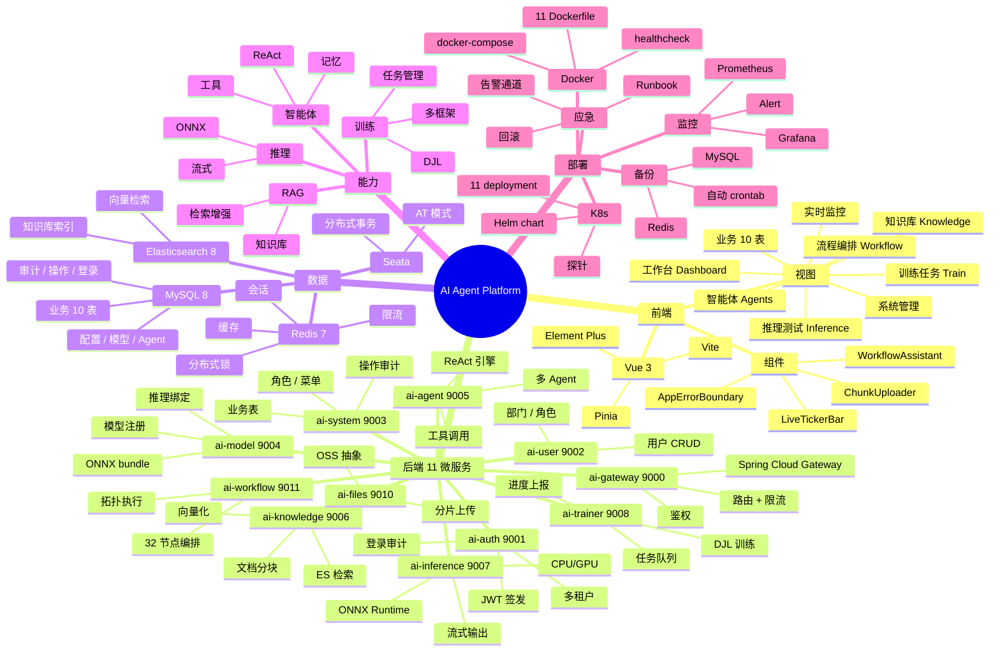
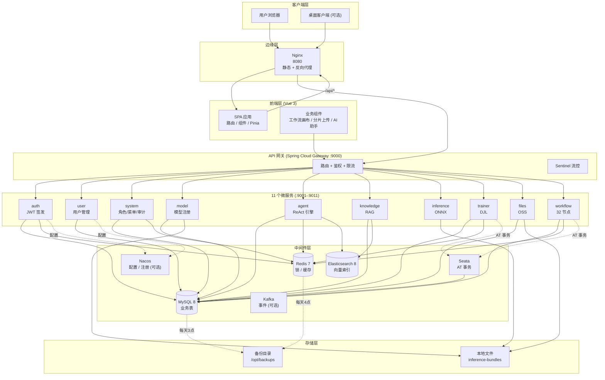
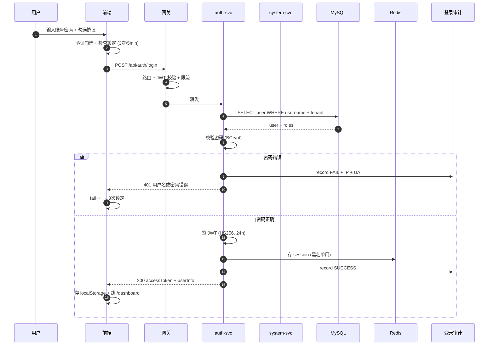
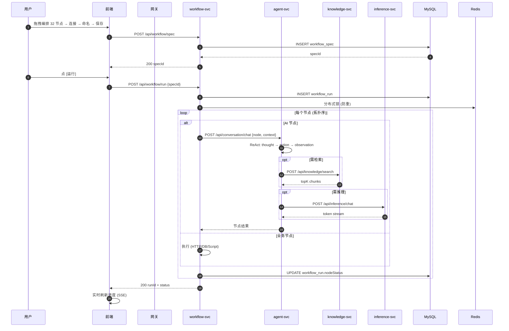
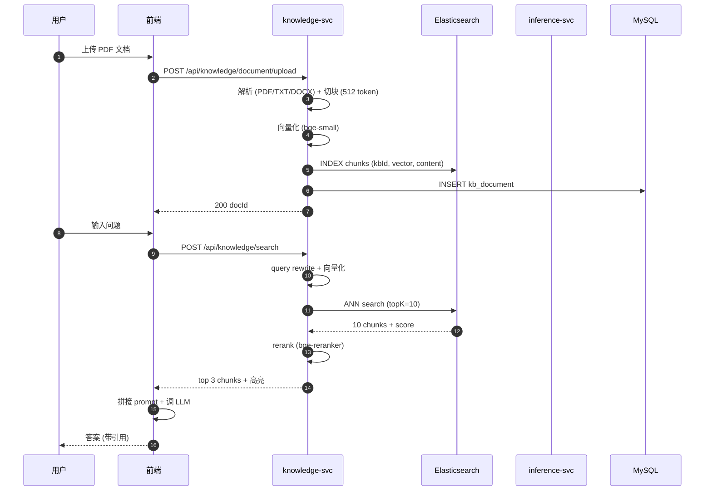
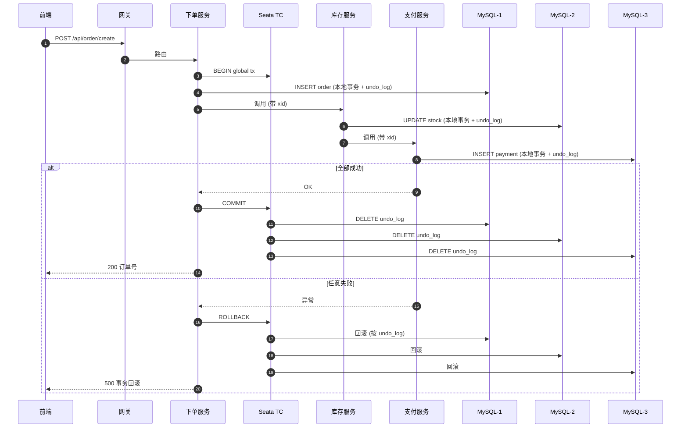
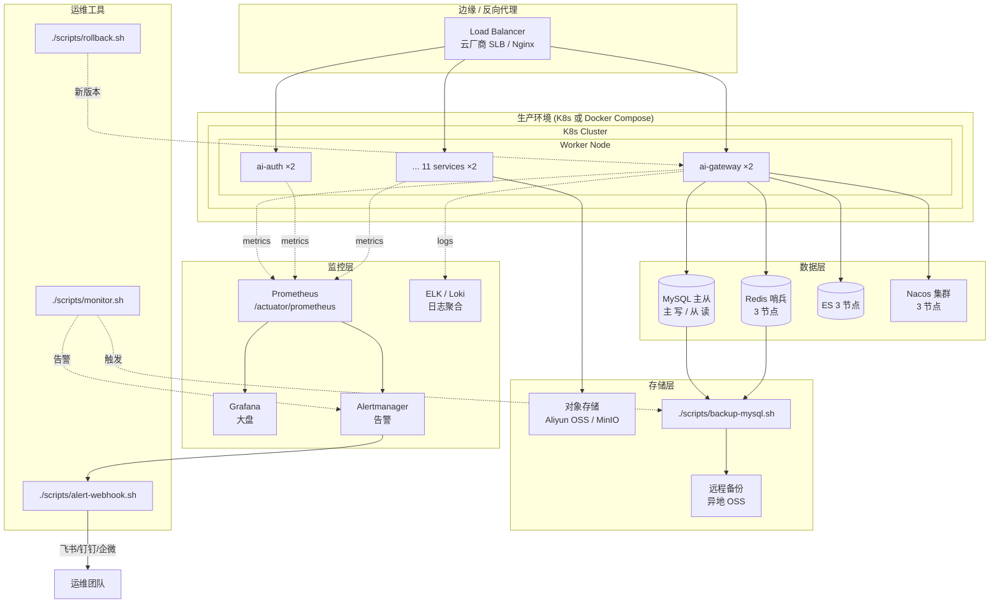

# AI Agent Platform 架构全景文档

> **版本**: v2.0
> **日期**: 2026-06-18
> **受众**: 架构师 / 后端开发 / 运维 / 产品 / 领导
> **范围**: 系统全栈 (11 微服务 + 前端 + 部署 + 监控 + 应急)

---

## 目录

1. 系统思维导图 (一图看全)
2. 系统功能架构图 (前后端 + 11 微服务)
3. 接口流程图 (核心业务时序)
4. 运维架构图 (部署 + 监控 + 应急)
5. 接口清单 (11 模块, 300+ 接口)
6. 运维操作手册 (日常 + 应急)

---

## 1. 系统思维导图

> 用 mermaid mindmap 描述系统的全貌, 分层展开.



---

## 2. 系统功能架构图

> 端到端架构, 自顶向下展示前端/网关/服务/数据 4 层.



---

## 3. 接口流程图 (核心业务时序)

### 3.1 用户登录 (认证 + 审计 + 限流)



### 3.2 工作流执行 (32 节点拓扑)



### 3.3 RAG 检索增强生成 (知识库 + 向量)



### 3.4 智能体 ReAct 调用 (多步推理)

```mermaid
sequenceDiagram
    autonumber
    participant U as 用户
    participant AG as agent-svc
    participant LLM as inference (LLM)
    participant TOOL as 工具 (HTTP/DB/RAG)
    participant DB as MySQL

    U->>AG: POST /api/conversation/chat {message, agentId}
    AG->>DB: 加载 agent 配置 (system prompt + tools)
    AG->>DB: INSERT agent_invoke_log (RUNNING)
    loop ReAct 循环 (最多 8 步)
        AG->>LLM: prompt = system + history + thought hint
        LLM-->>AG: Thought: ... Action: toolName(args)
        alt Action 是工具
            AG->>TOOL: 执行工具
            TOOL-->>AG: Observation: result
        else Action 是 Final
            AG->>AG: 提取 Final Answer
            break 退出循环
        end
    end
    AG->>DB: UPDATE log (OK, tokens, costMs)
    AG-->>U: 流式输出答案
```

### 3.5 分布式事务 (Seata AT 模式)



---

## 4. 运维架构图



---

## 5. 接口清单 (11 模块 × ~30 接口 = 300+ 接口)

### 5.1 ai-gateway (端口 9000)

| 方法 | 路径 | 说明 |
|---|---|---|
| ALL | `/api/**` | 统一入口, 路由转发到后端服务 |
| GET | `/actuator/health` | 探活端点 (Docker HEALTHCHECK / K8s probe) |
| GET | `/actuator/prometheus` | Prometheus 抓取指标 |

### 5.2 ai-auth (端口 9001) — 认证授权

| 方法 | 路径 | 说明 |
|---|---|---|
| POST | `/api/auth/login` | 用户登录, 返回 JWT + userInfo |
| POST | `/api/auth/logout` | 注销, JWT 加入黑名单 |
| POST | `/api/auth/refresh` | 刷新 JWT (用 refresh_token) |
| GET | `/api/auth/me` | 获取当前登录用户信息 |
| POST | `/api/auth/change-password` | 改密 (旧 + 新) |
| POST | `/api/auth/captcha` | 获取图形验证码 |
| GET | `/api/auth/health` | 服务健康 |

### 5.3 ai-user (端口 9002) — 用户管理

| 方法 | 路径 | 说明 |
|---|---|---|
| GET | `/api/user/page` | 分页查询用户 (支持 username/dept/role 过滤) |
| GET | `/api/user/{id}` | 用户详情 |
| POST | `/api/user` | 创建用户 (密码 BCrypt 加密) |
| PUT | `/api/user/{id}` | 更新用户 |
| DELETE | `/api/user/{id}` | 删除用户 (软删) |
| POST | `/api/user/{id}/reset-password` | 重置密码 (管理员) |
| POST | `/api/user/{id}/toggle-status` | 启/停用 |
| GET | `/api/user/stats` | 统计 (总/今日新增/活跃) |

### 5.4 ai-system (端口 9003) — 系统管理 + 业务

| 方法 | 路径 | 说明 |
|---|---|---|
| 角色 | | |
| GET | `/api/role/page` | 分页查询角色 |
| POST | `/api/role` | 创建角色 |
| PUT | `/api/role/{id}` | 更新角色 |
| DELETE | `/api/role/{id}` | 删除角色 |
| POST | `/api/role/{id}/assign` | 分配权限 |
| GET | `/api/role/stats` | 角色统计 |
| 菜单 | | |
| GET | `/api/menu/tree` | 菜单树 (按用户权限) |
| POST | `/api/menu` | 创建菜单 |
| PUT | `/api/menu/{id}` | 更新菜单 |
| 业务 | | |
| GET | `/api/biz/customer/page` | 客户分页 |
| POST | `/api/biz/customer` | 创建客户 |
| ... | (商机/合同/订单/产品 等等) | 共 10 个业务实体, ~50 接口 |
| 审计 | | |
| GET | `/api/audit/login/page` | 登录审计分页 |
| GET | `/api/audit/login/stats` | 登录统计 |
| GET | `/api/audit/login/trend` | 趋势 (7/30 天) |
| GET | `/api/audit/operation/page` | 操作审计分页 (本轮新加) |
| GET | `/api/audit/operation/stats` | 操作审计统计 |
| 监控 | | |
| GET | `/api/monitor/snapshot` | 9 服务健康快照 |
| GET | `/api/monitor/metrics` | 指标 (CPU/内存/磁盘) |
| GET | `/api/monitor/stream` | SSE 实时事件流 |

### 5.5 ai-model (端口 9004) — 模型管理

| 方法 | 路径 | 说明 |
|---|---|---|
| GET | `/api/model/page` | 模型分页 |
| GET | `/api/model/{id}` | 模型详情 (含版本) |
| POST | `/api/model` | 注册模型 (指向 ONNX bundle) |
| PUT | `/api/model/{id}` | 更新模型元信息 |
| DELETE | `/api/model/{id}` | 删除模型 |
| POST | `/api/model/{id}/publish` | 发布版本 |
| GET | `/api/model/{id}/versions` | 版本列表 |
| POST | `/api/model/{id}/export` | 导出 ONNX bundle |

### 5.6 ai-agent (端口 9005) — 智能体

| 方法 | 路径 | 说明 |
|---|---|---|
| GET | `/api/agent/page` | 智能体分页 |
| GET | `/api/agent/{id}` | 详情 (含 system prompt + tools) |
| POST | `/api/agent` | 创建 |
| PUT | `/api/agent/{id}` | 更新 |
| DELETE | `/api/agent/{id}` | 删除 |
| POST | `/api/conversation/chat` | 核心: 聊天 (ReAct) |
| GET | `/api/conversation/history` | 历史消息 |
| GET | `/api/agent/invoke/logs` | 调用日志 |

### 5.7 ai-knowledge (端口 9006) — 知识库

| 方法 | 路径 | 说明 |
|---|---|---|
| GET | `/api/knowledge/base/list` | 知识库列表 |
| POST | `/api/knowledge/base` | 创建知识库 |
| DELETE | `/api/knowledge/base/{id}` | 删除 (级联删文档) |
| GET | `/api/knowledge/document/page` | 文档分页 |
| POST | `/api/knowledge/document/upload` | 上传 + 解析 + 向量化 |
| DELETE | `/api/knowledge/document/{id}` | 删文档 |
| GET | `/api/knowledge/search` | 检索 (rerank) |
| GET | `/api/knowledge/search-enhanced` | 检索 (高亮+片段) |
| GET | `/api/knowledge/search-all` | 跨库检索 |
| POST | `/api/knowledge/embed` | 单独向量化 |
| POST | `/api/knowledge/vector/index` | 重建索引 |

### 5.8 ai-inference (端口 9007) — 推理

| 方法 | 路径 | 说明 |
|---|---|---|
| GET | `/api/inference/models` | 可用模型列表 |
| POST | `/api/inference/chat` | 聊天 (流式 SSE) |
| POST | `/api/inference/generate` | 文本生成 |
| POST | `/api/inference/embed` | embedding |
| GET | `/api/inference/bundle/{name}` | 下载 bundle |
| GET | `/api/inference/health` | 健康 |

### 5.9 ai-trainer (端口 9008) — 训练

| 方法 | 路径 | 说明 |
|---|---|---|
| POST | `/api/train/submit` | 提交训练任务 |
| GET | `/api/train/page` | 任务分页 |
| GET | `/api/train/{id}` | 任务详情 |
| DELETE | `/api/train/{id}` | 取消任务 |
| GET | `/api/train/jobs` | 任务列表 (DB + 内存) |
| GET | `/api/train/{id}/logs` | 训练日志 |
| GET | `/api/train/health` | 健康 |
| GET | `/api/train/preview/{id}` | 训练进度 SSE |

### 5.10 ai-files (端口 9010) — 文件管理

| 方法 | 路径 | 说明 |
|---|---|---|
| POST | `/api/files/chunk/init` | 初始化分片上传 |
| PUT | `/api/files/chunk/{uploadId}/{index}` | 上传分片 |
| GET | `/api/files/chunk/{uploadId}/status` | 查询已上传分片 |
| POST | `/api/files/chunk/{uploadId}/complete` | 合并分片 |
| GET | `/api/files/page` | 文件分页 |
| GET | `/api/files/{id}` | 文件详情 |
| DELETE | `/api/files/{id}` | 删除文件 |
| GET | `/api/files/{id}/download` | 下载 |

### 5.11 ai-workflow (端口 9011) — 工作流

| 方法 | 路径 | 说明 |
|---|---|---|
| GET | `/api/workflow/spec/page` | 流程分页 |
| GET | `/api/workflow/spec/{id}` | 流程详情 |
| POST | `/api/workflow/spec` | 保存流程 |
| POST | `/api/workflow/spec/{id}/duplicate` | 复制流程 |
| DELETE | `/api/workflow/spec/{id}` | 删除流程 |
| POST | `/api/workflow/run` | 执行流程 (同步) |
| POST | `/api/workflow/run/async` | 异步执行 |
| GET | `/api/workflow/run/{id}` | 运行状态 |
| GET | `/api/workflow/run/page` | 运行历史 |
| GET | `/api/workflow/nodes` | 32 节点类型定义 |

---

## 6. 运维操作手册 (日常 + 应急)

### 6.1 日常巡检 (每天 9:00)

```bash
# 1) 一键看全
./scripts/monitor.sh

# 2) 看昨天告警
#   → http://localhost:3000 (Grafana, admin/admin)
#   → 飞书 #ops-alert 频道

# 3) 检查备份
ls -la /opt/ai-platform/backups/mysql/ | tail -5

# 4) 看磁盘
df -h /
```

### 6.2 部署 (新版本上线)

```bash
# 1) 跑测试
cd backend && mvn test

# 2) build (自动打版本标签)
cd ..
./scripts/build.sh 2.0.20260619

# 3) 滚动更新 (K8s) 或重启 (Compose)
kubectl set image deployment/ai-gateway ai-gateway=ai-gateway:2.0.20260619
# 或
cd deploy/docker && VERSION=2.0.20260619 docker compose up -d

# 4) 验证
sleep 30 && curl http://localhost:9000/actuator/health
```

### 6.3 备份恢复

```bash
# 手动备份
./scripts/backup-mysql.sh
./scripts/backup-redis.sh

# 自动备份 (crontab)
0 3 * * * /opt/ai-platform/scripts/backup-mysql.sh >> /var/log/backup.log 2>&1
0 4 * * * /opt/ai-platform/scripts/backup-redis.sh >> /var/log/backup.log 2>&1

# 恢复 (带确认提示)
./scripts/restore-mysql.sh /opt/ai-platform/backups/mysql/ai_platform_20260618_030000.sql.gz
```

### 6.4 回滚

```bash
# 1) 查历史版本
docker images | grep "ai-gateway" | head -10

# 2) 一键回滚
./scripts/rollback.sh gateway 2.0.20260617
```

### 6.5 常见故障 Runbook

| 故障 | 现象 | 排查命令 | 修法 |
|---|---|---|---|
| **Gateway 502** | 前端 502 | `docker logs ai-gateway` | `docker compose restart gateway` |
| **MySQL 连不上** | Communications link failure | `docker exec ai-mysql mysql -uroot -p -e "SHOW PROCESSLIST"` | 杀慢查询, 重启服务 |
| **Redis 挂** | 分布式锁/限流失效 | `docker exec ai-redis redis-cli ping` | `docker compose restart redis` |
| **ES 满** | 知识库检索失败 | `curl localhost:9200/_cat/indices?v` | 删旧索引 + 重建 |
| **Nacos 挂** | 配置失联 | `curl localhost:8848/nacos/` | `docker compose restart nacos` |
| **磁盘满** | 服务写失败 | `df -h /` | 删 `*.log.gz` + 扩盘 |
| **JWT_SECRET 报错** | 服务启不来 | 看启动日志红框 | `export JWT_SECRET=$(./scripts/gen-jwt-secret.sh)` |
| **登录失败 3 次** | 用户被锁 5min | localStorage 计数 | 5 分钟后自动解锁 |
| **操作审计查询慢** | sys_operation_audit 大 | `EXPLAIN SELECT * FROM sys_operation_audit WHERE create_time > ?` | 加索引 / 归档 |

### 6.6 应急响应 (P0 流程)

```
[故障发生] → 监控告警 → 飞书群 (1min)
     ↓
[值班确认] → 拉相关同事 → 评估 P0/P1/P2 (5min)
     ↓
[立即止血] → 重启 / 回滚 (10-30min)
     ↓
[根因分析] → 5 why / fishbone (4h)
     ↓
[事故报告] → 模板见 docs/INCIDENT-RESPONSE.md (24h)
     ↓
[改进项] → 排期修复, 防再次发生
```

### 6.7 监控告警 (Prometheus 5 规则)

| 规则 | 触发 | 等级 | 通知 |
|---|---|---|---|
| ServiceDown | 服务停止响应 2min | critical | 飞书 @oncall |
| HighCpuUsage | CPU > 85% 持续 5min | warning | 飞书 |
| HighMemoryUsage | 内存 > 90% 持续 5min | warning | 飞书 |
| DiskFull | 磁盘 > 85% 持续 5min | warning | 飞书 |
| SlowResponse | 99 分位延迟 > 3s 持续 5min | warning | 飞书 |

### 6.8 升级 / 变更

```bash
# 1) 评估影响 (RACI: 谁负责 / 批准 / 咨询 / 知会)
# 2) 测试环境跑通
# 3) 灰度 10% → 50% → 100%
# 4) 监控 (15min 一次)
# 5) 全量 + 公告
```

### 6.9 安全合规

```bash
# 1) JWT_SECRET 定期换 (季度)
./scripts/gen-jwt-secret.sh  # 生成新
# 改 Nacos / .env, 重启服务

# 2) 数据库密码定期换
# 3) 依赖升级 (OWASP 扫描)
# 4) 等保测评 (年度)
```

### 6.10 容量规划

```
1 用户 → 100 MB (MySQL 10 行 ≈ 10MB)
100 用户 → 10 GB
1000 用户 → 100 GB (1 节点 MySQL 16G 内存够)
10000 用户 → 1 TB (主从分离 + 分库分表)
```
