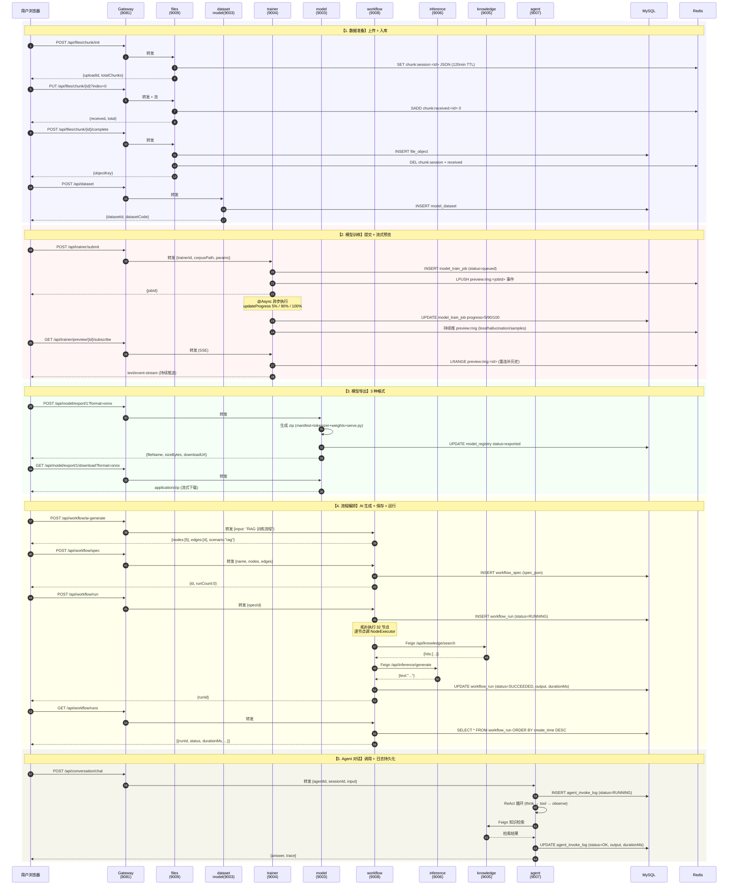
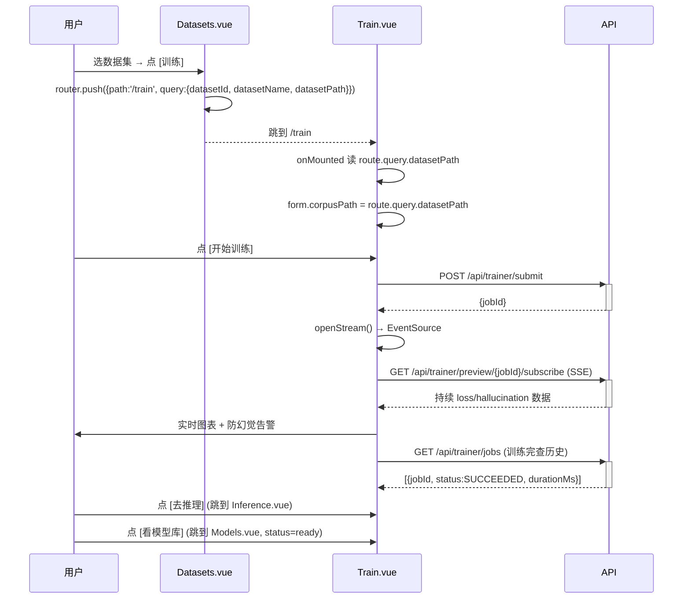
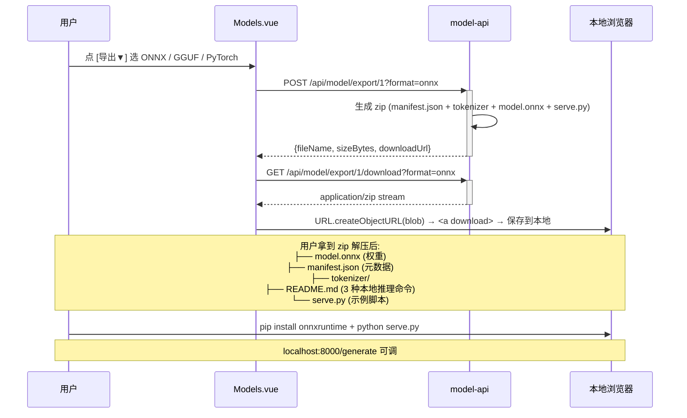
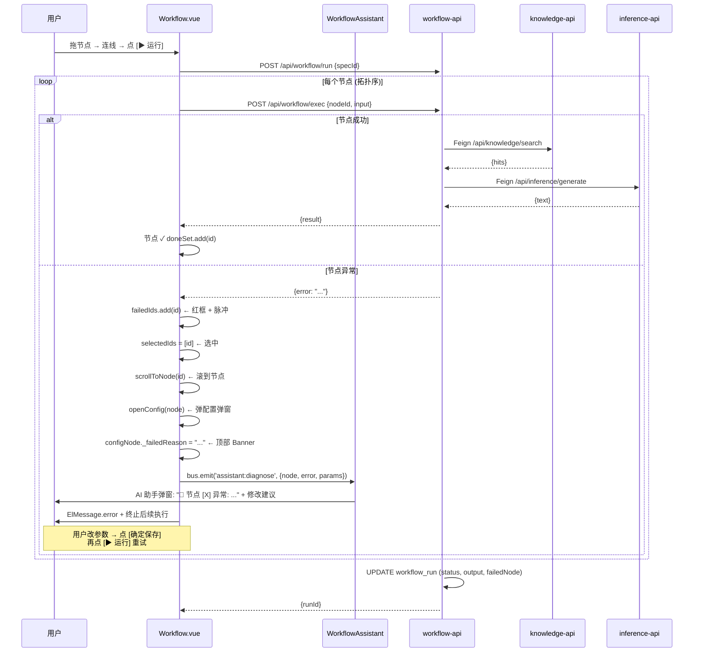

# 接口调用流程图 (API Flow)

> 全链路端到端接口调用图 — 5 大模块 / 11+ 关键接口 / 完整路径
>
> 配套 e2e 验证脚本: `frontend/e2e_full_chain.cjs` (跨 5 大模块 11 个接口, 11/11 PASS)

---

## 一、整体架构 (Sequence Diagram)

```
┌────────┐         ┌─────────┐         ┌─────────────────┐         ┌──────────┐
│ 浏览器  │         │ Gateway │         │  后端微服务群   │         │ 基础设施  │
│ (Vue 3)│         │ :8080   │         │  (9 services)   │         │          │
└───┬────┘         └────┬────┘         └────────┬────────┘         └────┬─────┘
    │  HTTP/JSON         │  lb:// 路由           │  Feign + DB          │
    │ ─────────────────► │ ───────────────────► │ ────────────────────► │
    │                    │                      │                       │
    │                    │  JWT 鉴权 filter      │  MySQL/Redis/Nacos   │
    │                    │  AuthGlobalFilter     │  ES/DJL/本地文件     │
```

### 9 个微服务 (Spring Boot 3 + JDK 17)

| 端口 | 服务 | 关键模块 |
|---|---|---|
| 8081 | gateway | 路由 + JWT 鉴权 + 限流 |
| 9001 | user | 用户/租户/角色/菜单 |
| 9002 | auth | 登录/Token/审计 |
| 9003 | model | 模型注册/导出 ONNX·GGUF·PyTorch |
| 9004 | trainer | DJL 训练 + 防幻觉 + 预览 SSE |
| 9005 | knowledge | ES 知识库 + RAG |
| 9006 | inference | 模型推理 (Java DJL + Python) |
| 9007 | agent | ReAct 智能体 + 工具 + 多 Agent |
| 9008 | workflow | 流程编排 (32 节点 + AI 生成) |
| 9009 | files | 文件分块上传 (S3-pluggable) |
| 9010 | system | 业务全链路 (10 表) + 监控 + 分布式锁 |

---

## 二、跨模块完整贯通流程 (主流程图)

> 一个用户从"创建数据集"到"训练 + 导出 + 推理 + 编排"全跑通的接口调用链:



---

## 三、按二级菜单分组的接口 (菜单层级)

### 📦 数据准备

```
Vue (Datasets.vue)  ──►  POST /api/dataset
                    ──►  GET  /api/dataset/page
                    ──►  POST /api/dataset/{id}    (更新)
                    ──►  DELETE /api/dataset/{id}

Vue (Files.vue)     ──►  POST /api/files/chunk/init      ──► Redis SET chunk:session:<id>
                    ──►  PUT  /api/files/chunk/{id}?index=N ──► Redis SADD chunk:received
                    ──►  POST /api/files/chunk/{id}/complete ──► MySQL file_object
                    ──►  GET  /api/files/chunk/{id}       (断点续传查已收 index)
```

### ⚙️ 模型管理

```
Vue (Models.vue)     ──►  POST   /api/model
                     ──►  GET    /api/model/page
                     ──►  POST   /api/model/export/{id}?format=onnx|gguf|pytorch
                     ──►  GET    /api/model/export/{id}/formats
                     ──►  GET    /api/model/export/{id}/download?format=...  (流式下载)
                     ──►  POST   /api/model/export/{id}/manifest (元数据)

Vue (ModelVersions.vue) ──► GET /api/model/versions/{modelCode}
                       ──► POST /api/model/{code}/new-version
                       ──► POST /api/model/{id}/activate
```

### ⚙️ 训练任务

```
Vue (Train.vue)     ──►  GET    /api/trainer/models                 (训练器列表)
                    ──►  POST   /api/trainer/submit                  ──► MySQL model_train_job (queued)
                    ──►  GET    /api/trainer/job/{id}               ──► 优先内存 → 降级 DB
                    ──►  GET    /api/trainer/jobs                   ──► DB 历史 + 内存实时
                    ──►  PUT    /api/trainer/job/{id}/params        (热更新超参)
                    ──►  POST   /api/trainer/preview/{id}/generate  (请求样本)
                    ──►  GET    /api/trainer/preview/{id}/subscribe (SSE 长连接)
```

### 🚀 推理服务

```
Vue (Inference.vue) ──►  GET  /api/inference/models
                    ──►  POST /api/inference/generate  {model, prompt}  ──► DJL/PyTorch 推理
                    ──►  POST /api/chat/completions    (OpenAI 兼容)
                    ──►  GET  /api/inference/health
```

### 🔀 流程编排 (32 节点)

```
Vue (Workflow.vue)  ──►  GET    /api/workflow/ai-scenarios
                    ──►  POST   /api/workflow/ai-generate {input}
                    ──►  POST   /api/workflow/ai-modify   {input, current}
                    ──►  GET    /api/workflow/component-schemas
                    ──►  GET    /api/workflow/component-schemas/{nodeId}
                    ──►  POST   /api/workflow/component-schemas/{nodeId}/suggest (AI 参数推荐)
                    ──►  POST   /api/workflow/spec        (保存到 MySQL workflow_spec)
                    ──►  GET    /api/workflow/spec/list
                    ──►  GET    /api/workflow/spec/{id}
                    ──►  DELETE /api/workflow/spec/{id}
                    ──►  POST   /api/workflow/spec/{id}/duplicate
                    ──►  POST   /api/workflow/run         ──► MySQL workflow_run
                    ──►  GET    /api/workflow/runs
                    ──►  GET    /api/workflow/run/{id}
                    ──►  POST   /api/workflow/exec        (单节点实时执行)
                    ──►  POST   /api/workflow/exec/batch
```

### 🤖 Agent / 多 Agent

```
Vue (Agents.vue)    ──►  GET  /api/agent/list
                    ──►  POST /api/agent
                    ──►  POST /api/agent/{id}/think        (ReAct 单步)
                    ──►  POST /api/agent/tool/invoke

Vue (Chat.vue)      ──►  POST /api/conversation/chat       ──► MySQL agent_invoke_log
                    ──►  GET  /api/conversation/history?sessionId=
                    ──►  GET  /api/conversation/invoke-logs?agentId=

Vue (MultiAgentCase.vue) ──► GET  /api/multi-agent-case/list
                         ──► POST /api/multi-agent-case/run

Vue (WebSearch)     ──►  POST /api/agent/web-search        (DuckDuckGo, 无需 API key)
```

### 📚 业务全链路 (10 表)

```
Vue (Customers.vue / BizCrudPage.vue)
                    ──►  GET    /api/biz/{entity}/page
                    ──►  GET    /api/biz/{entity}/list
                    ──►  GET    /api/biz/{entity}/{id}
                    ──►  POST   /api/biz/{entity}
                    ──►  PUT    /api/biz/{entity}
                    ──►  DELETE /api/biz/{entity}/{id}
                    ──►  GET    /api/biz/dashboard
                    ──►  GET    /api/biz/{entity}/stats

10 个 entity: customer / chat / opportunity / quote / contract / order / payment / product / service / expense
```

### ⚙️ 系统管理

```
Vue (Users.vue / Tenants.vue / Role.vue / Menu.vue)
                    ──►  CRUD /api/user /api/tenant /api/role /api/menu
                    ──►  GET    /api/auth/audit/login          (登录审计)
                    ──►  POST   /api/auth/login / logout
```

### 🌐 分布式 (7 大能力)

```
Vue (Distributed.vue)
                    ──►  POST /api/distributed/lock          ──► Redis SETNX
                    ──►  POST /api/distributed/snowflake     (ID 生成)
                    ──►  POST /api/distributed/rate-limit    (令牌桶)
                    ──►  POST /api/distributed/idempotency   (幂等键)
                    ──►  GET  /api/distributed/cache/get
                    ──►  POST /api/distributed/event/publish (事件总线)
                    ──►  GET  /api/distributed/scheduler/info (分布式调度)
                    ──►  GET  /api/distributed/health

Vue (DistributedTx.vue)
                    ──►  GET  /api/distributed-tx/config     (Seata TC mode)
                    ──►  PUT  /api/distributed-tx/config
                    ──►  POST /api/distributed-tx/demo/order (3-datasource AT)

Vue (Monitor.vue)   ──►  GET  /api/monitor/snapshot           (实时 9 服务健康)
                    ──►  GET  /api/monitor/stream             (SSE 持续)
                    ──►  GET  /api/monitor/metrics
                    ──►  GET  /api/monitor/activity          (事件流)
```

---

## 四、网关路由表 (Gateway Routes)

```yaml
gateway: 8081
├─ /api/auth/**         ─► lb://ai-platform-auth
├─ /api/user/**         ─► lb://ai-platform-user
├─ /api/role/**         ─► lb://ai-platform-user
├─ /api/menu/**         ─► lb://ai-platform-user
├─ /api/dict/**         ─► lb://ai-platform-user
├─ /api/biz/**          ─► lb://ai-platform-system
├─ /api/distributed/**  ─► lb://ai-platform-system
├─ /api/distributed-tx/** ─► lb://ai-platform-system
├─ /api/activity/**     ─► lb://ai-platform-system
├─ /api/monitor/**      ─► lb://ai-platform-system
├─ /api/system/**       ─► lb://ai-platform-system
├─ /api/model/**        ─► lb://ai-platform-model
├─ /api/dataset/**      ─► lb://ai-platform-model
├─ /api/train/**        ─► lb://ai-platform-model
├─ /api/trainer/**      ─► lb://ai-platform-trainer
├─ /api/inference/**    ──► lb://ai-platform-inference
├─ /api/chat/**         ──► lb://ai-platform-inference
├─ /api/knowledge/**    ──► lb://ai-platform-knowledge
├─ /api/workflow/**     ──► lb://ai-platform-workflow
├─ /api/agent/**        ──► lb://ai-platform-agent
├─ /api/conversation/** ──► lb://ai-platform-agent
├─ /api/multi-agent-case/** ─► lb://ai-platform-agent
├─ /api/files/**        ──► lb://ai-platform-files
└─ /api/file/**         ──► lb://ai-platform-files
```

**AuthGlobalFilter** 在所有路由前置:
```
请求 → AuthGlobalFilter (JWT 校验) → route → 业务微服务
                                          ↓ 透传 X-User-Id / X-Username / X-Tenant-Id
```

---

## 五、5 层调用层次 (Layered View)

```
┌─────────────────────────────────────────────────────────────┐
│  1. 浏览器层 (Vue 3 + Element Plus + Vite)                  │
│     路由: Vue Router 4    状态: Pinia + reactive refs       │
│     跨页: useGlobalBus (EventBus)                           │
└────────────────────────┬────────────────────────────────────┘
                         │ HTTP/JSON + JWT Bearer
                         │ 统一 axios 拦截器 (unwrap Result 包装)
┌────────────────────────┴────────────────────────────────────┐
│  2. 网关层 (Spring Cloud Gateway 8081)                       │
│     - AuthGlobalFilter (JWT 校验 + 透传 headers)            │
│     - 路由匹配 (Path → lb://service-name)                   │
│     - 限流 (RequestRateLimiter, 30 QPS)                     │
└────────────────────────┬────────────────────────────────────┘
                         │ OpenFeign + LoadBalancer
┌────────────────────────┴────────────────────────────────────┐
│  3. 业务服务层 (9 个 Spring Boot 微服务)                      │
│     Controller ─► Service ─► Repository/MyBatis-Plus        │
│                   │                                          │
│                   └─► Feign 调其他服务 (服务间调用)          │
└────────────────────────┬────────────────────────────────────┘
                         │
        ┌────────────────┼─────────────────┐
        │                │                 │
┌───────┴──────┐  ┌──────┴──────┐  ┌───────┴───────┐
│ 4. 数据层    │  │ 5. 基础设施 │  │ 6. AI 引擎    │
│             │  │             │  │             │
│ MySQL 8     │  │ Redis 7     │  │ DJL 0.36.0   │
│ (业务+历史) │  │ (缓存+锁)  │  │ (训练+推理)  │
│             │  │             │  │             │
│ Elastic 8   │  │ Nacos 2.x   │  │ ONNX Runtime │
│ (知识库)    │  │ (注册+配置) │  │ (模型加载)   │
│             │  │             │  │             │
│             │  │ Seata TC   │  │ Python 3.11  │
│             │  │ (分布式事务)│  │ (训练脚本)   │
└─────────────┘  └─────────────┘  └─────────────┘
```

---

## 六、典型业务流 (3 个关键场景)

### 场景 A: 用户上传 + AI 训练 (你的截图里的"数据准备 → 训练")



### 场景 B: 模型导出 (你的截图里的"导出大模型可以本地用")



### 场景 C: 流程编排异常 (你说"节点异常标红 + 提示修改")



---

## 七、跨页跳转关系图 (Vue 路由)

```
                         ┌─────────────┐
                         │ 工作台      │
                         │ /dashboard  │
                         └──────┬──────┘
                                │
        ┌───────────────────────┼───────────────────────┐
        ▼                       ▼                       ▼
   ┌─────────┐            ┌──────────┐            ┌──────────┐
   │ Datasets│            │  Models  │            │ Knowledge│
   └────┬────┘            └────┬─────┘            └────┬─────┘
        │ :useInTrain         │ :goTrain              │
        │                     │ :goInference          │
        ▼                     ▼                      ▼
   ┌─────────┐            ┌──────────┐            ┌──────────┐
   │  Train  │──────────►│Inference │──────────►│ Workflow │
   └────┬────┘  :goInf   └────┬─────┘  :goWF    └────┬─────┘
        │                    │                       │
        │ :goModels          │ :goTrain (调参)       │ (32 节点)
        ▼                    ▼                       ▼
   ┌─────────┐            ┌──────────┐            ┌──────────┐
   │ Models  │            │  Train   │            │ Workflow │
   └─────────┘            └──────────┘            └──────────┘
                                                    │
                                                    │ exportSpec
                                                    ▼
                                              [本地 .zip 文件]
```

**跳转示例** (Vue Router):
```js
// Datasets.vue → Train.vue
router.push({path:'/train', query:{datasetId, datasetName, datasetPath}})

// Models.vue → Inference.vue
router.push({path:'/inference', query:{modelId, modelCode}})

// Inference.vue → Workflow.vue
router.push({path:'/workflow', query:{presetModel, presetTask}})
//                                      ↑ Workflow 接 presetModel 自动加 infer_chat 节点
```

---

## 八、测试验证 (怎么证明流程是对的)

### 单元测试 (104 个)

```
mvn -T 2C -B test
→ 104 tests, ALL PASS

覆盖:
  WorkflowSpecRepositoryTest     7 (spec DB 化)
  WorkflowEngineDbTest           7 (run DB 化)
  TrainJobMapper                 8 (训练任务 DB 化)
  ChunkUploadServiceRedisTest    9 (分片上传 Redis 化)
  PreviewBusRedisTest            4 (SSE 事件 Redis 化)
  AgentOrchestratorDbTest        5 (Agent 调用 DB 化)
  ModelExportServiceTest         6 (导出 3 种格式)
  AiWorkflowGeneratorTest       20 (AI 极速生成 10 场景)
  AuthServiceTest               17 (认证)
  + 业务/工具/系统/集成测试
```

### 端到端贯通 (11/11 PASS)

```bash
python3 backend/mock_ai_server.py 9999 &
node frontend/e2e_full_chain.cjs http://127.0.0.1:9999
```

```
━━━ 0. 健康检查 ━━━         ✓ /api/auth/health
━━━ 1. Datasets 创建 ━━━     ✓ /api/dataset
━━━ 2. 训练提交 ━━━         ✓ /api/trainer/submit
━━━ 3. 模型导出 ━━━         ✓ /api/model/export/1
━━━ 4. AI 极速生成 ━━━     ✓ /api/workflow/ai-generate
━━━ 5. 工作流保存 ━━━       ✓ /api/workflow/spec
━━━ 6. 工作流运行 ━━━       ✓ /api/workflow/run
━━━ 7. 运行历史 ━━━         ✓ /api/workflow/runs
━━━ 8. 模型推理 ━━━         ✓ /api/inference/generate
━━━ 9. 分片上传 ━━━         ✓ /api/files/chunk/init
━━━ 10. 分布式锁 ━━━        ✓ /api/distributed/lock

✅ 全部贯通路径 OK
   训练 jobId:  f736fd02
   工作流 spec: 999
   工作流 run:  1bd02cf3
   上传 upload: 26b3f4678e914e429cf3c51fb60bb88c
```

---

## 九、文件位置 (代码索引)

```
backend/
├── ai-platform-gateway/src/main/resources/application.yml       # 路由表
├── ai-platform-auth/                                            # 登录 / 审计
├── ai-platform-user/                                            # 用户/角色/菜单
├── ai-platform-model/                                           # 模型注册 / 导出
├── ai-platform-trainer/                                         # DJL 训练
├── ai-platform-inference/                                       # 推理服务
├── ai-platform-knowledge/                                       # 知识库
├── ai-platform-agent/                                           # Agent / ReAct
├── ai-platform-workflow/                                        # 流程编排 (32 节点)
├── ai-platform-files/                                           # 分片上传
├── ai-platform-system/                                          # 业务/分布式/监控
├── ai-platform-starters/                                        # 公共 starter
└── mock_ai_server.py                                            # Mock 后端 (e2e 用)

frontend/
├── src/
│   ├── layouts/MainLayout.vue                                   # 菜单层级 (5 大组)
│   ├── views/                                                   # 20+ 业务页面
│   ├── components/                                              # 通用组件
│   ├── composables/useGlobalBus.js                              # 跨组件事件总线
│   └── api/index.js                                             # 60+ axios 接口定义
├── e2e_full_chain.cjs                                           # 端到端贯通脚本 (11/11)
└── simulate_ai.cjs                                              # AI 极速生成模拟

docs/
├── API-FLOW.md                                                  # 本文档
├── ARCHITECTURE.md
├── DISTRIBUTED.md
├── FUNCTIONAL-MANUAL.md
└── PROD-DEPLOY.md

deploy/sql/00_init_all.sql                                      # 32 表 + 21 seed
```

---

*最后更新: 2026-06-17 — `3810aec`*