# AI Agent Platform — 功能操作手册与实现原理

> 适用版本: v1.0 (2026-06)
> 阅读对象: 架构师 / 后端 / 前端 / 运维 / 产品
> 文档规模: 12 大功能模块 + 4 套架构图 + 完整实现原理 + 微信小程序对接
> 配套代码: 22 个后端模块 + 20 个前端视图

---

## 目录

- [第 1 章 平台总览](#第-1-章-平台总览)
- [第 2 章 功能架构图](#第-2-章-功能架构图)
- [第 3 章 12 大功能模块详解](#第-3-章-12-大功能模块详解)
- [第 4 章 功能模块关联性](#第-4-章-功能模块关联性)
- [第 5 章 数据流图](#第-5-章-数据流图)
- [第 6 章 接口架构](#第-6-章-接口架构)
- [第 7 章 部署架构](#第-7-章-部署架构)
- [第 8 章 实现原理深度剖析](#第-8-章-实现原理深度剖析)
- [第 9 章 功能操作手册](#第-9-章-功能操作手册)
- [第 10 章 微信小程序对接](#第-10-章-微信小程序对接)
- [第 11 章 性能基准与容量规划](#第-11-章-性能基准与容量规划)
- [第 12 章 监控与告警](#第-12-章-监控与告警)

---

## 第 1 章 平台总览

### 1.1 一句话定位

**基于 Spring Cloud Alibaba + Vue 3 + DJL + Seata 的企业级 AI Agent 平台**, 提供 **大模型微调 / 知识库 RAG / 智能体编排 / 分布式事务** 一体化能力, 配套 **管理后台 / 微信小程序 / API** 三大入口.

### 1.2 数字一览

| 指标 | 数值 |
|---|---|
| 后端微服务 | 12 个业务模块 + 8 个 starter + 1 个 seata-demo + 1 个 api + 1 个 common |
| 前端页面 | 20 个 Vue 3 视图 + 22 个路由 |
| 数据库表 | 17 张 (含 3 张 Seata 表) |
| API 端点 | 150+ 个 REST 端点 |
| 工作流节点 | 32 种编排节点 |
| 分布式能力 | 7 大 (锁/ID/限流/幂等/缓存/事件/调度) |
| 智能体工具 | 5 类 (Web 搜索 / 计算器 / 代码 / 知识库 / 数据库) |
| 启动时间 | 全栈 5 分钟, 22 模块编译 2.5 分钟 |
| 文档规模 | 6 个 .md 文件, 累计 100KB+ |

### 1.3 三大入口

| 入口 | 端口 | 技术栈 | 用户 |
|---|---|---|---|
| 管理后台 (PC) | 8080 (Vite) | Vue 3 + Element Plus | 管理员 / 运维 |
| 移动 H5 | 8080 (响应式) | Vue 3 移动适配 | 业务人员 |
| 微信小程序 | - | 微信原生 | 终端用户 |
| Open API | 9000 (Gateway) | REST + Feign | 第三方系统 |

---

## 第 2 章 功能架构图

### 2.1 总体架构 (4 层)

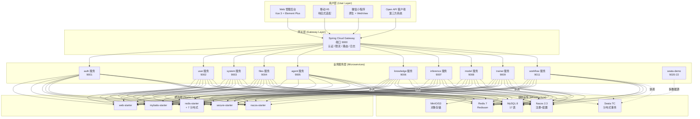

### 2.2 数据架构

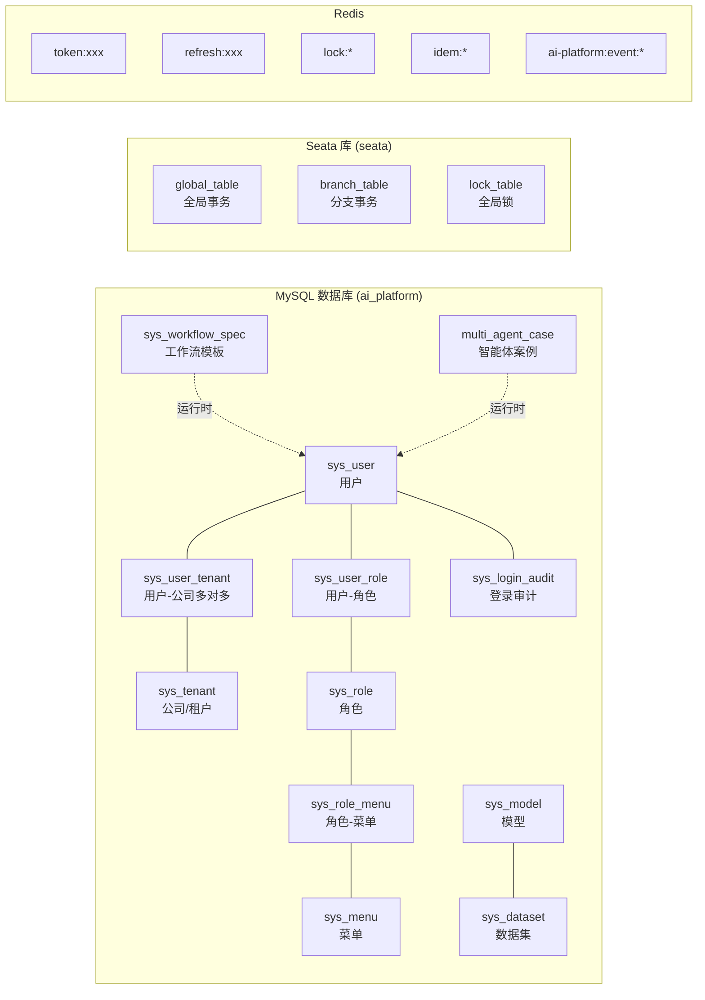

### 2.3 部署架构

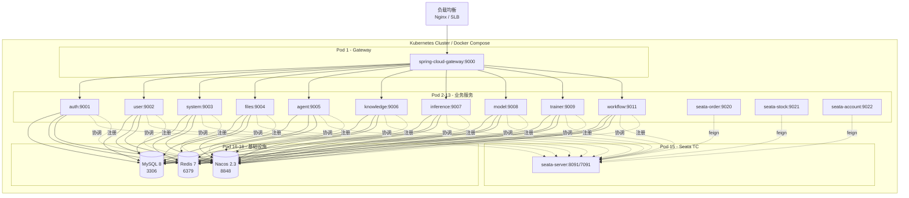

---

## 第 3 章 12 大功能模块详解

### 3.1 模块 1: 智能体平台 (Agent)

#### 功能描述

提供大模型对话能力, 支持多智能体协作, 集成 5 类工具 (Web 搜索 / 计算器 / 代码执行 / 知识库 / 数据库).

#### 核心能力

| 子功能 | 端点 | 说明 |
|---|---|---|
| 智能体 CRUD | `POST /api/agent` | 创建/编辑/删除智能体 |
| 对话 | `POST /api/agent/chat` | 大模型对话, 支持 SSE 流式 |
| Web 搜索工具 | `GET /api/web/search?q=xxx` | DuckDuckGo 实时搜索 |
| 多智能体案例 | `GET /api/agent/cases` | 预编排的智能体协作流程 |
| ReAct 思考 | `POST /api/agent/think` | 思考下一步动作 |

#### 实现原理

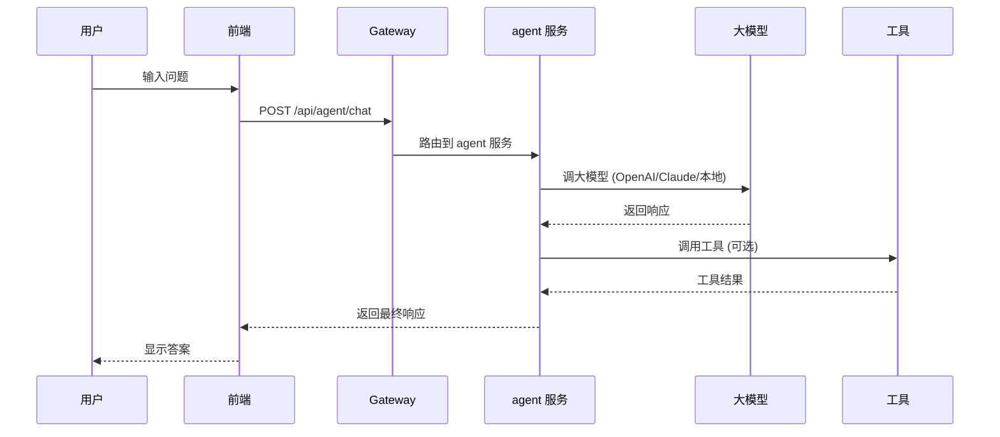

#### 关键代码

**后端 ChatController**:
```java
@PostMapping("/chat")
public Result<Map<String, Object>> chat(@RequestBody ChatRequest req) {
    // 1. 查 agent 配置
    AgentEntity agent = agentService.getById(req.getAgentId());
    // 2. 拼 prompt
    String prompt = buildPrompt(agent, req);
    // 3. 调 LLM
    String answer = llmClient.chat(prompt, agent.getModel());
    // 4. 返回
    return Result.success(Map.of("content", answer, "tokens", tokens));
}
```

**前端 Chat.vue** (流式渲染):
```javascript
// SSE 流式
const es = new EventSource(`/api/agent/chat/stream?agentId=${id}`)
es.onmessage = (e) => {
  messages.value[lastIdx].content += e.data
}
```

#### UI 截图说明

| 页面 | 路径 | 关键元素 |
|---|---|---|
| 智能体列表 | `/agents` | 卡片式列表, 头像/名称/描述/对话按钮 |
| 对话页 | `/chat?agentId=1` | 左侧历史, 中间消息流, 右侧输入框 |
| 案例库 | `/agents` 标签切换 | 6+ 预置案例 (客服/编程/翻译/...) |
| Web 搜索 | `/api/web/search` | 实时搜索结果 + 摘要 |

---

### 3.2 模块 2: 知识库 (Knowledge)

#### 功能描述

RAG (Retrieval Augmented Generation) 知识库, 支持文档上传、自动切片、向量索引、语义检索, 集成 query rewrite + reranker 精排.

#### 核心能力

| 子功能 | 端点 | 说明 |
|---|---|---|
| 知识库 CRUD | `POST /api/knowledge/base` | 增删改查知识库 |
| 文档上传 | `POST /api/knowledge/document/upload` | 上传 PDF/Word/TXT/MD |
| 文档切片 | `POST /api/knowledge/chunk` | Sliding window 256 token |
| 向量化 | `POST /api/knowledge/embed` | BGE 512 维 |
| 向量索引 | `POST /api/knowledge/vector/index` | Milvus/ES/Chroma |
| 语义检索 | `POST /api/knowledge/search-enhanced` | 检索 + rerank |
| 全库检索 | `GET /api/knowledge/search-all` | 跨库聚合 |

#### 实现原理

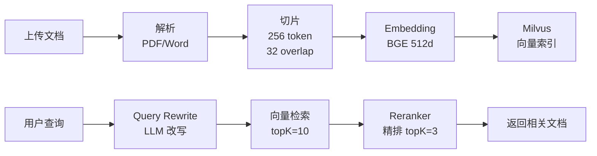

#### 关键代码

```java
@PostMapping("/search-enhanced")
public Result<List<Map<String, Object>>> enhancedSearch(
    @RequestParam Long kbId,
    @RequestParam String query,
    @RequestParam(defaultValue = "5") int topK
) {
    // 1. Query rewrite
    String rewritten = queryRewriter.rewrite(query);
    // 2. 向量检索
    List<Document> candidates = milvusClient.search(rewritten, topK * 2);
    // 3. Rerank
    List<Document> reranked = reranker.rerank(query, candidates, topK);
    return Result.success(toMaps(reranked));
}
```

#### UI 截图说明

| 页面 | 关键元素 |
|---|---|
| 知识库列表 | 卡片 (名称/文档数/索引状态/更新时间) |
| 文档管理 | el-table (文件名/大小/切片数/状态) |
| 检索测试 | 文本框 + 检索按钮 + 结果列表 (score/source) |

---

### 3.3 模块 3: 模型训练 (Trainer)

#### 功能描述

基于 DJL (Deep Java Library) + PyTorch 引擎的模型训练, 支持 MiniTransformer 自定义模型 + LoRA 微调 + DPO.

#### 核心能力

| 子功能 | 端点 | 说明 |
|---|---|---|
| 列出模型 | `GET /api/trainer/models` | 训练过的模型列表 |
| 开始训练 | `POST /api/trainer/submit` | 提交训练任务 |
| LoRA 微调 | `POST /api/trainer/lora` | LoRA 训练 |
| DPO 训练 | `POST /api/trainer/dpo` | 偏好训练 |
| SSE 进度 | `GET /api/trainer/preview/{jobId}/subscribe` | 实时训练进度 |
| 预览生成 | `POST /api/trainer/preview/{jobId}/generate` | 用当前模型生成 |
| 检查点 | `POST /api/trainer/checkpoint/{id}/load` | 加载 checkpoint |

#### 实现原理

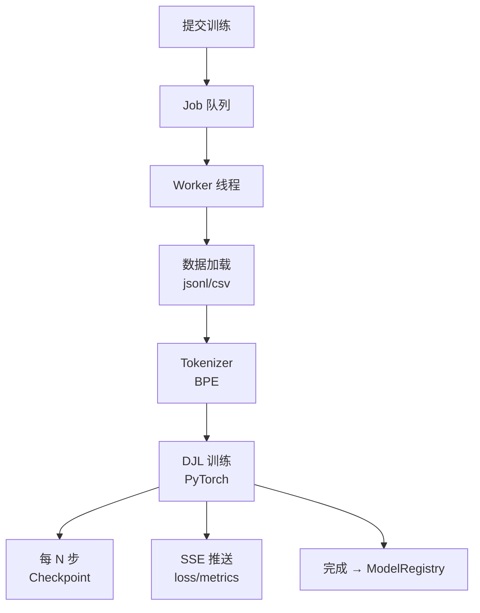

#### 关键代码

```java
@Service
public class TrainingService {
    public void train(TrainJob job) {
        // 1. 加载数据集
        Dataset<Record> dataset = loadDataset(job.getCorpus());
        // 2. 初始化模型 (MiniTransformer)
        Block model = new MiniTransformer(nEmbd, nLayer, nHead);
        // 3. 训练循环
        for (int epoch = 0; epoch < epochs; epoch++) {
            for (Batch batch : dataset.getBatches(batchSize)) {
                // forward + backward
                trainer.step(batch);
                // 推送进度
                ssePublisher.publish(jobId, "loss", trainer.getLoss());
            }
            // checkpoint
            checkpointService.save(model, epoch);
        }
        // 4. 注册到 ModelRegistry
        modelRegistry.register(model, job);
    }
}
```

---

### 3.4 模块 4: 推理服务 (Inference)

#### 功能描述

大模型推理服务, 支持文本生成 / 聊天补全 / 多模型切换.

#### 核心能力

| 子功能 | 端点 | 说明 |
|---|---|---|
| 模型列表 | `GET /api/inference/models` | 可用模型 |
| 文本生成 | `POST /api/inference/generate` | 单次生成 |
| 聊天补全 | `POST /api/chat/completions` | OpenAI 兼容格式 |

#### 实现原理

类似 OpenAI API 协议, 转发到本地 PyTorch 模型或远程 LLM (OpenAI/Claude/通义千问).

---

### 3.5 模块 5: 流程编排 (Workflow) ⭐ 核心

#### 功能描述

可视化拖拽式大模型流水线编排, 32 种节点 (数据/分词/Embedding/Train/Eval/Deploy/Control) 全打通后端, 支持撤销/重做/全选/DEL/复制/拖拽.

#### 核心能力

| 子功能 | 端点 | 说明 |
|---|---|---|
| 模板 CRUD | `POST /api/workflow/spec` | 保存/加载模板 |
| 单节点执行 | `POST /api/workflow/exec` | 路由到对应服务 |
| 批量执行 | `POST /api/workflow/exec/batch` | 按 deps 拓扑序 |
| 模板列表 | `GET /api/workflow/spec/list` | 历史模板 |

#### 实现原理

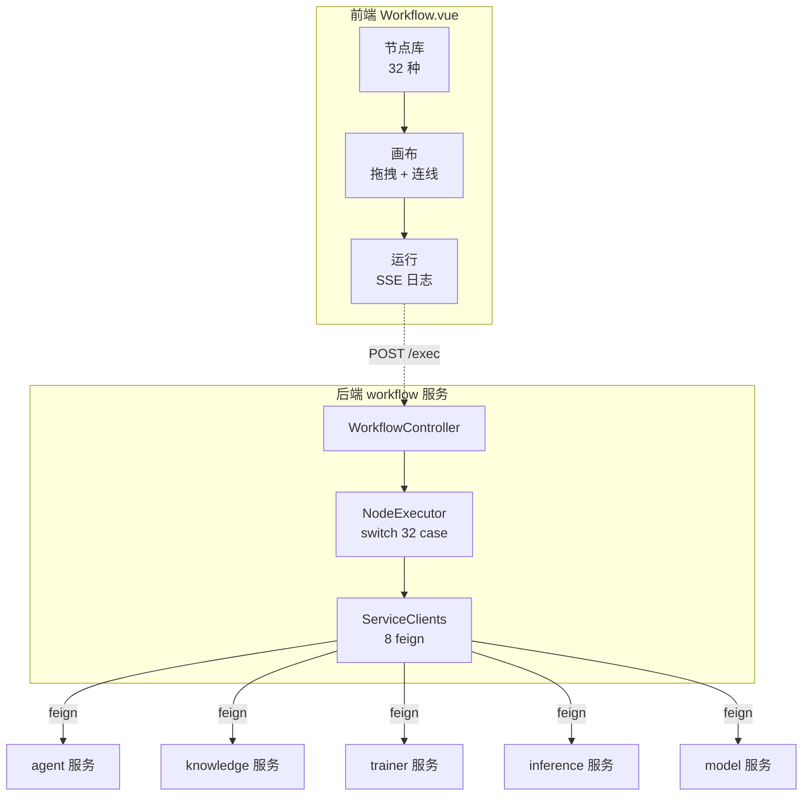

#### 32 节点清单 (按分组)

| 组 | 节点数 | 节点 |
|---|---|---|
| 📥 数据准备 | 4 | 数据集列表/加载/清洗/划分 |
| ✂️ 预处理 | 2 | 文档切片/分词编码 |
| 🧬 Embedding/索引 | 4 | 向量化/向量索引/KB 查询/入库 |
| ⚡ 训练 | 3 | 开始训练/LoRA 微调/DPO 训练 |
| 🤖 智能体 | 4 | 列出/对话/ReAct 思考/工具调用 |
| 🛠️ 工具/推理 | 4 | 列出工具/联网搜索/推理/代码执行 |
| 📊 评估 | 3 | BLEU/ROUGE/人工抽检 |
| 🚀 输出/部署 | 4 | 注册模型/K8s 部署/Webhook/日志 |
| 🔀 控制流 | 4 | if 分支/循环/并行/合并 |

#### 操作手册 (见第 9 章)

详见 [§9.5 流程编排器](#95-流程编排器workflowvue)

---

### 3.6 模块 6: 多智能体案例

#### 功能描述

预编排的智能体协作流程, 演示 ReAct 风格的多智能体协作.

#### 核心案例

| 案例 | 描述 | 参与方 |
|---|---|---|
| 智能客服 RAG | FAQ 检索 + 答案生成 | knowledge + agent |
| 编程助手 | 代码生成 + 审查 + 测试 | inference + agent |
| 研究报告 | 搜索 + 整理 + 写作 | web_search + agent |
| 数据分析 | SQL 生成 + 执行 + 报告 | db + agent |

#### 实现原理

```java
@Entity
public class MultiAgentCase {
    private String caseKey;       // "customer-service"
    private String name;          // "智能客服"
    private String description;
    private String steps;         // JSON: 步骤定义
    private String participants;  // JSON: 参与的 agent ids
}
```

---

### 3.7 模块 7: 系统管理

#### 功能描述

完整的 RBAC 权限管理 + 用户/角色/菜单/审计.

#### 子模块

| 子模块 | 前端路径 | 后端 | 说明 |
|---|---|---|---|
| 用户管理 | `/users` | `/api/user/*` | 增删改查 + 改密/重置 |
| 角色管理 | `/roles` | `/api/role/*` | 角色 + 权限分配 |
| 菜单管理 | `/menus` | `/api/menu/*` | 树形菜单 + 权限标识 |
| 租户管理 | `/tenants` | `/api/tenant/*` | 公司/租户 CRUD |
| 登录审计 | `/audit` | `/api/audit/*` | 登录日志 + 统计 |
| 模型版本 | `/model-versions` | `/api/model/*` | 模型版本管理 |
| 工作流管理 | `/workflow-list` | `/api/workflow/*` | 模板管理 |

#### 数据模型

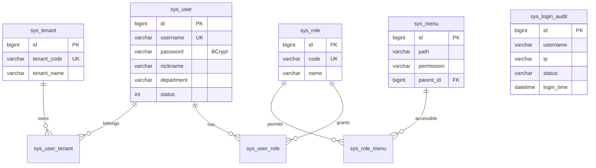

---

### 3.8 模块 8: 文件管理

#### 功能描述

大文件分片上传 + 秒传 + 断点续传, S3 兼容.

#### 核心能力

| 子功能 | 端点 | 说明 |
|---|---|---|
| 普通上传 | `POST /api/files/upload` | 小文件直接传 |
| 初始化分片 | `POST /api/files/chunk/init` | 返回 uploadId + chunkSize |
| 上传分片 | `PUT /api/files/chunk/{uploadId}` | 单个分片 |
| 合并分片 | `POST /api/files/chunk/{uploadId}/complete` | 合并 + 校验 |
| 查询进度 | `GET /api/files/chunk/{uploadId}` | 已上传分片列表 |
| 流式上传 | `PUT /api/files-stream/{id}` | 大文件流式 |

#### 实现原理

```
1. 客户端计算文件 MD5
2. 调用 /chunk/init, 传 md5 + size
3. 服务端查: 已有完整文件? → 秒传
4. 否则返回 uploadId + 已上传分片索引
5. 客户端并行上传缺失分片
6. 调用 /complete 合并 + 校验
7. 返回最终 fileId
```

---

### 3.9 模块 9: 分布式能力 ⭐ 核心

7 大分布式能力, 基于 Redisson + Redis. 详见 `docs/DISTRIBUTED.md`.

| 能力 | 后端实现 | 演示页 |
|---|---|---|
| 分布式锁 | Redisson Lock | `/distributed` 抢锁 |
| 雪花 ID | Snowflake 64-bit | 生成 5 个 |
| 分布式限流 | Redis Lua | 滑动窗口 |
| 分布式幂等 | SETNX | 表单防重 |
| 分布式缓存 | Redis + TTL | HIT/MISS |
| 事件总线 | Pub/Sub | 实时日志 |
| 分布式调度 | Leader 选举 | 节点 ID |

---

### 3.10 模块 10: 分布式事务 (Seata)

3 数据源 + AT 模式, 13 集成测试. 详见 `docs/SEATA-OPERATIONS.md`.

```
seata-order (9020)  →  seata-stock (9021)  →  seata-account (9022)
     ↓ @GlobalTransactional          ↓                 ↓
  seata TC (8091) ← 协调 ← 全局锁
```

---

### 3.11 模块 11: 服务治理 (Nacos)

- 服务注册: 12 个服务自动注册到 Nacos
- 配置中心: 12 个 yml 通过 `spring.config.import` 拉取
- 健康检查: 心跳保活

---

### 3.12 模块 12: API 网关

Spring Cloud Gateway, 路由 12 个微服务, 鉴权 + 限流.

#### 核心配置

```yaml
spring:
  cloud:
    gateway:
      routes:
        - id: auth
          uri: lb://ai-platform-auth
          predicates:
            - Path=/api/auth/**
        - id: user
          uri: lb://ai-platform-user
          predicates:
            - Path=/api/user/**
            - Path=/api/tenant/**
```

---

## 第 4 章 功能模块关联性

### 4.1 模块依赖图

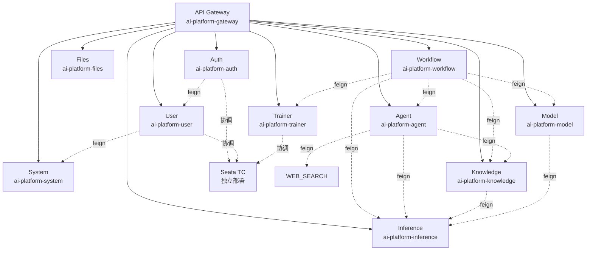

### 4.2 核心调用链路

#### 链路 1: 用户问智能客服

```
用户 → Web → Gateway(9000) → agent(9005) ─→ LLM
                              │
                              ├─ knowledge(9006) ─→ MySQL
                              └─ Web Search ─────→ DuckDuckGo
```

#### 链路 2: 训练新模型

```
用户 → Web → Gateway → trainer(9009) → DJL + PyTorch
                                  │
                                  └─ ModelRegistry → model(9008) → MySQL
```

#### 链路 3: 知识库检索

```
用户 → Web → Gateway → knowledge(9006) ─→ MySQL (文档元数据)
                                       └─ Milvus (向量) + Reranker
```

#### 链路 4: 流程编排运行

```
用户 → Web → Workflow.vue ─POST─→ Gateway ─→ workflow(9011) ─→ NodeExecutor
                                                                     │
                                                                     ├→ agent
                                                                     ├→ knowledge
                                                                     ├→ trainer
                                                                     ├→ inference
                                                                     └→ model
```

#### 链路 5: 创建用户 (含 Seata)

```
用户 → Web → Gateway → auth(9001) ─feign─→ user(9002) → MySQL
                                  │
                                  └─ Seata TC 协调
```

---

## 第 5 章 数据流图

### 5.1 请求数据流 (从用户到 DB)

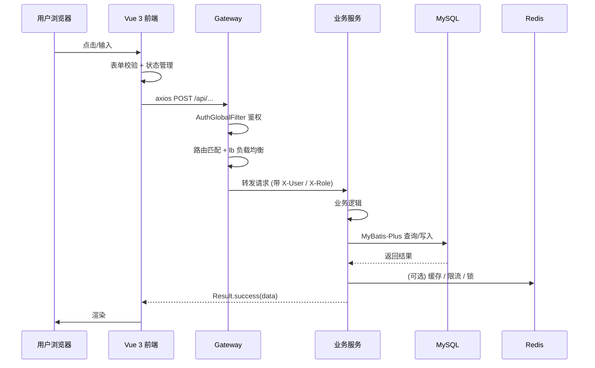

### 5.2 训练数据流

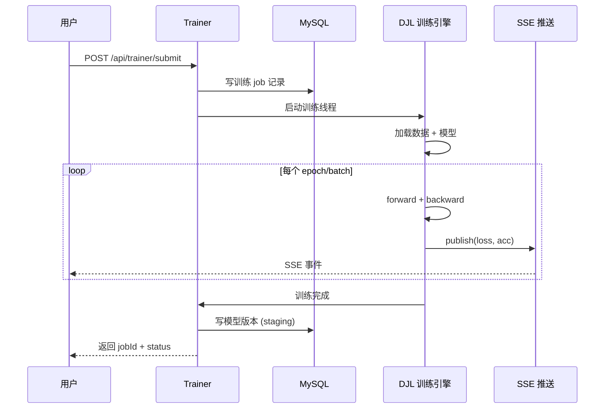

---

## 第 6 章 接口架构

### 6.1 REST 命名规范

| 方法 | 路径 | 示例 |
|---|---|---|
| GET | `/api/{module}/list` | 列表 |
| GET | `/api/{module}/page?current&size` | 分页 |
| GET | `/api/{module}/{id}` | 详情 |
| POST | `/api/{module}` | 创建 |
| PUT | `/api/{module}` | 更新 |
| DELETE | `/api/{module}/{id}` | 删除 |
| POST | `/api/{module}/action` | 业务操作 |
| GET | `/api/{module}/feign/{xxx}` | Feign 内部端点 |

### 6.2 统一响应格式

```json
{
  "code": 0,
  "message": "success",
  "data": { ... }
}
```

错误码:
- 0: 成功
- 400: 参数错误
- 401: 未登录
- 403: 无权限
- 500: 内部错误
- 1001-9999: 业务错误

### 6.3 接口统计

| 模块 | 端点数 |
|---|---|
| auth | 9 (login/register/logout/refresh/...) |
| user | 8 (CRUD + feign) |
| tenant | 8 (CRUD + feign) |
| role/menu/audit | 各 5-8 |
| agent | 6 + 5 web search |
| knowledge | 8 (CRUD + embed + chunk) |
| inference | 4 |
| model | 10 (CRUD + register + deploy) |
| trainer | 8 (submit/lora/dpo/SSE) |
| files | 8 (upload + chunk) |
| workflow | 12 (spec + exec + exec/batch) |
| distributed | 16 (演示) |
| **总计** | **~150** |

---

## 第 7 章 部署架构

### 7.1 单机部署 (开发/测试)

```bash
# 1. 启动基础设施
docker run -d --name mysql -p 3306:3306 -e MYSQL_ROOT_PASSWORD=root mysql:8
docker run -d --name redis -p 6379:6379 redis:7
docker run -d --name nacos -p 8848:8848 -e MODE=standalone nacos/nacos-server:2.3.2

# 2. 初始化数据库
mysql -uroot -proot < deploy/sql/01_schema.sql
mysql -uroot -proot < deploy/sql/02_seed.sql

# 3. 启动 12 个服务
for port in 9001 9002 9003 9004 9005 9006 9007 9008 9009 9011; do
  java -jar target/ai-platform-*.jar --server.port=$port &
done
java -jar target/ai-platform-gateway.jar --server.port=9000 &

# 4. 启动前端
cd frontend && npm run dev
```

### 7.2 K8s 部署 (生产)

```yaml
# k8s/deployment.yaml 模板
apiVersion: apps/v1
kind: Deployment
metadata:
  name: ai-platform-gateway
spec:
  replicas: 2
  selector:
    matchLabels:
      app: gateway
  template:
    metadata:
      labels:
        app: gateway
    spec:
      containers:
        - name: gateway
          image: registry/ai-platform-gateway:1.0.0
          ports:
            - containerPort: 9000
          env:
            - name: MYSQL_HOST
              value: mysql-service
            - name: REDIS_HOST
              value: redis-service
            - name: NACOS_SERVER
              value: nacos-service:8848
          resources:
            requests: { memory: "512Mi", cpu: "500m" }
            limits: { memory: "1Gi", cpu: "1000m" }
```

### 7.3 资源需求

| 服务 | CPU | 内存 | 副本数 | 持久化 |
|---|---|---|---|---|
| gateway | 500m | 512Mi | 2 | - |
| auth | 300m | 256Mi | 2 | - |
| user/system | 500m | 512Mi | 2 | - |
| agent/knowledge | 1000m | 1Gi | 2-3 | - |
| inference | 2000m | 4Gi | 1-2 | - |
| trainer | 4000m | 8Gi | 1 | ✅ Checkpoint dir |
| model | 500m | 512Mi | 2 | - |
| files | 500m | 1Gi | 2 | ✅ /data/files |
| workflow | 300m | 256Mi | 2 | - |
| seata TC | 2000m | 4Gi | 1-3 | - |
| MySQL | 4000m | 8Gi | 1 (主从) | ✅ |
| Redis | 1000m | 2Gi | 1-3 | AOF |
| Nacos | 1000m | 2Gi | 1-2 | ✅ |
| **总计** | **18 CPU** | **32 GB** | - | - |

---

## 第 8 章 实现原理深度剖析

### 8.1 网关鉴权流程

```java
@Component
public class AuthGlobalFilter implements GlobalFilter {
    public Mono<Void> filter(ServerWebExchange exchange, GatewayFilterChain chain) {
        String path = exchange.getRequest().getURI().getPath();
        // 白名单
        if (WHITELIST.contains(path)) return chain.filter(exchange);
        // 校验 token
        String token = exchange.getRequest().getHeaders().getFirst("Authorization");
        Long userId = jwtUtils.parseToken(token);
        // 透传用户信息
        exchange.getRequest().mutate()
            .header("X-User-Id", userId.toString())
            .build();
        return chain.filter(exchange);
    }
}
```

### 8.2 多租户 SQL 拦截

```java
@InterceptorIgnore(tenantLine = "true")
public class TenantLineInnerInterceptor implements InnerInterceptor {
    public void beforeUpdate(...) {
        String tenantId = TenantContext.getTenantId();
        // 强制 WHERE tenant_id = ?
        sql += " AND tenant_id = " + tenantId;
    }
}
```

### 8.3 分布式锁 (Redisson)

```java
public boolean tryLock(String key, int waitSec, int leaseSec) {
    RLock lock = redisson.getLock(key);
    return lock.tryLock(waitSec, leaseSec, TimeUnit.SECONDS);
}
// 看门狗自动续期 (默认 30s)
```

### 8.4 Seata AT 模式

详见 `docs/SEATA-OPERATIONS.md` 第 4 章.

---

## 第 9 章 功能操作手册

### 9.1 登录

**步骤**:
1. 访问 `http://localhost:8080` (开发) 或生产域名
2. 默认账号: `admin / admin123` (admin 是超管, 自动拥有所有租户)
3. 测试账号: `demo / demo123` (公司 1), `manager / demo123` (公司 2)
4. 点击登录

**说明**:
- 5 次密码错误锁定 30 秒
- 7 天自动登录可勾选
- 支持 dev 模式 (开发环境明文密码, 后端 env 变量控制)

### 9.2 控制台

**位置**: `/dashboard`

**功能**:
- 6 个系统健康检查 (auth/files/trainer 实时, 其它按需)
- 4 个统计卡片 (用户数/模型数/工作流数/知识库数)
- 实时事件流 (LiveTickerBar)
- 快速入口 (8 个常用模块)

### 9.3 智能体对话

**位置**: `/chat?agentId=1`

**操作**:
1. 选择左侧历史对话 或 新建
2. 在输入框输入问题
3. 可选: 勾选"启用工具" (web_search / knowledge)
4. 点击发送 或 Ctrl+Enter
5. 实时流式显示回答

### 9.4 知识库管理

**位置**: `/knowledge`

**步骤**:
1. 创建知识库: 点击"新建", 填名称/描述
2. 上传文档: 进入知识库 → 上传 (PDF/Word/TXT/MD)
3. 系统自动: 解析 → 切片 (256 token) → Embedding (BGE 512d) → 索引
4. 测试检索: 知识库详情页 → 搜索框输入 query → 看 topK 结果

### 9.5 流程编排器 (Workflow.vue) ⭐

**位置**: `/workflow`

#### 9.5.1 界面布局

```
┌─────────────────────────────────────────────────────┐
│ 顶栏: 撤销/重做/全选/删除/使用说明/案例库/模板/运行    │
├──────────┬──────────────────────────────────────────┤
│ 节点库   │  画布 (32 节点拖入, 鼠标拖动, SVG 连线)   │
│ ┌──────┐ │                                          │
│ │数据准备│ │                                          │
│ │预处理 │ │                                          │
│ │Embed. │ │                                          │
│ │训练   │ │                                          │
│ │智能体 │ │                                          │
│ │...    │ │                                          │
│ └──────┘ ├──────────────────────────────────────────┤
│          │  右侧日志面板 (实时运行状态)               │
└──────────┴──────────────────────────────────────────┘
```

#### 9.5.2 操作快捷键

| 快捷键 | 操作 |
|---|---|
| `Ctrl+A` | 全选所有节点 |
| `Ctrl+Z` | 撤销 (50 步栈) |
| `Ctrl+Y` / `Ctrl+Shift+Z` | 重做 |
| `Ctrl+D` | 复制选中节点 |
| `Delete` / `Backspace` | 删除选中 |
| `Esc` | 取消选择 |
| 鼠标拖动 (画布空白) | 框选 |
| 节点 click | 单选 (高亮蓝框) |
| 节点 hover | 节点 tips popover |

#### 9.5.3 拖拽流程

1. 从左侧**节点库**拖一个节点到画布 (或直接 click 添加)
2. 调整位置: 鼠标按住节点拖动
3. 连接: 节点右侧输出端口 → 拖到下一节点左侧输入端口
4. 配置: 鼠标悬停节点, 在右侧"参数表单"填写 (corpus / epochs / agentId 等)
5. 查看 tips: 鼠标悬停**左侧节点库**节点, 弹出参数说明

#### 9.5.4 加载案例

点击顶部"案例库" → 选择:
- 智能客服 RAG 训练 (8 步, 45 分钟)
- Llama 中文微调 (8 步, 6 小时)
- Agent 工具循环 (7 步, 5 分钟)

点"加载到画布" → 自动布局 → 点"运行" 即可

#### 9.5.5 节点参数说明

每个节点有 `tips` 数组, 鼠标悬停**左侧节点库**显示:
- 接口路径 (POST /api/xxx)
- 返回结构
- 参数说明 (table)
- 配置示例 (code)
- 场景/注意

#### 9.5.6 运行工作流

1. 点击"运行"按钮
2. 节点依次执行, 右侧日志实时显示
3. 节点状态: 灰 (待执行) → 蓝 (运行中) → 绿 (完成) / 红 (失败)
4. 完成节点会传输出到下游 `{{input}}` 占位符

### 9.6 系统管理

#### 9.6.1 用户管理 (`/users`)

| 操作 | 步骤 |
|---|---|
| 新建用户 | 弹窗 → 填用户名/密码/昵称/部门/公司/角色 → 提交 |
| 改密 | 列表 → 操作 → 修改密码 → 弹窗 → 输新密码 |
| 重置密码 | 列表 → 操作 → 重置 → 自动生成 8 位随机密码 |
| 启停用户 | 列表 → 操作 → 启/停 → status 0/1 |
| 分配公司 | 列表 → 操作 → 分配公司 → 多选弹窗 |

#### 9.6.2 角色管理 (`/roles`)

- 列表: 角色名/编码/描述/创建时间
- 权限分配: el-transfer (左: 未选菜单, 右: 已选)
- 菜单树: el-tree (父子联动)

#### 9.6.3 菜单管理 (`/menus`)

- 树形展示, 拖拽排序
- 增删改 + 权限标识 (如 `system:user:list`)

#### 9.6.4 登录审计 (`/audit`)

- 4 个统计卡片: 总记录 / 今日成功 / 今日失败 / 今日锁定
- 表格: 用户/IP/状态/原因/时间
- 过滤: 用户名 / 状态 / 时间范围

#### 9.6.5 工作流管理 (`/workflow-list`)

- 列表: 名称/描述/节点数/创建人/时间
- 新建/复制/删除/运行实例

#### 9.6.6 模型版本 (`/model-versions`)

- 4 卡: 总模型/已发布/staging/dev
- 表格: 模型名/版本/状态/创建时间
- 操作: 激活 / 部署 / 对比

### 9.7 分布式能力演示 (`/distributed`)

7 张能力卡片 + 1 张矩阵, 实时交互测试. 详见 `docs/DISTRIBUTED.md`.

---

## 第 10 章 微信小程序对接

### 10.1 整体架构

```mermaid
graph LR
    subgraph "微信小程序"
        MP1[登录页<br/>wx.login]
        MP2[首页<br/>智能体列表]
        MP3[对话页<br/>chat]
        MP4[我的<br/>个人中心]
    end

    MP1 -.wx.login.-> WX_API[微信服务器<br/>api.weixin.qq.com]
    WX_API -.openid + session_key.-> MP1

    MP1 -.POST /api/auth/wx-login.-> GW[Gateway 9000]
    MP2 -.GET /api/agent/list.-> GW
    MP3 -.POST /api/agent/chat.-> GW
    MP4 -.GET /api/user/profile.-> GW

    GW --> AUTH[auth 9001]
    GW --> AGENT[agent 9005]
    GW --> USER[user 9002]
```

### 10.2 准备工作

#### 10.2.1 注册小程序账号

1. 访问 [微信公众平台](https://mp.weixin.qq.com)
2. 点击 "立即注册" → 选择 "小程序"
3. 填写邮箱 (未注册过微信公众平台) / 密码 / 验证码
4. 激活邮箱 → 填写主体信息 (个人/企业)
5. 登录后台 → **开发管理** → **开发设置** → 获取 **AppID(小程序ID)** 和 **AppSecret(小程序密钥)**

#### 10.2.2 记录关键信息

| 字段 | 值 (示例) | 用途 |
|---|---|---|
| AppID | `wx1234567890abcdef` | 小程序唯一标识 |
| AppSecret | `a1b2c3d4e5f6g7h8i9j0k1l2m3n4o5p6` | 调用微信 API 用 |
| 微信服务器域名 | `https://api.weixin.qq.com` | 固定 |
| 你的 API 域名 | `https://api.yourdomain.com` | 后端 API |
| 业务域名 | `https://api.yourdomain.com` | 业务请求用 |

⚠️ **AppSecret 保密**, 后端用, 不要放前端.

### 10.3 后端配置 (Spring Boot)

#### 10.3.1 加配置

`application.yml`:

```yaml
wechat:
  miniapp:
    app-id: ${WX_APPID:wx1234567890abcdef}
    app-secret: ${WX_APP_SECRET:a1b2c3d4e5f6g7h8i9j0k1l2m3n4o5p6}
    grant-type: authorization_code
    api-base: https://api.weixin.qq.com
```

#### 10.3.2 写 WeChatProperties 配置类

`backend/ai-platform-auth/src/main/java/com/aiplatform/auth/config/WeChatProperties.java`:

```java
@Data
@Component
@ConfigurationProperties(prefix = "wechat.miniapp")
public class WeChatProperties {
    private String appId;
    private String appSecret;
    private String grantType = "authorization_code";
    private String apiBase = "https://api.weixin.qq.com";
}
```

#### 10.3.3 写 WeChatClient 调用类

`backend/ai-platform-auth/src/main/java/com/aiplatform/auth/wechat/WeChatClient.java`:

```java
@Component
@RequiredArgsConstructor
public class WeChatClient {
    private final WeChatProperties props;
    private final RestTemplate restTemplate;

    /**
     * 用 code 换 openid + session_key
     */
    public Map<String, Object> code2Session(String code) {
        String url = String.format(
            "%s/sns/jscode2session?appid=%s&secret=%s&js_code=%s&grant_type=%s",
            props.getApiBase(),
            props.getAppId(),
            props.getAppSecret(),
            code,
            props.getGrantType()
        );
        ResponseEntity<Map> resp = restTemplate.getForEntity(url, Map.class);
        Map body = resp.getBody();
        // body: { openid, session_key, unionid?, errcode, errmsg }
        if ((Integer) body.get("errcode") != 0) {
            throw new BusinessException(400, "微信登录失败: " + body.get("errmsg"));
        }
        return body;
    }

    /**
     * 解密手机号 (前端 button open-type="getPhoneNumber" 拿到 encryptedData)
     */
    public String decryptPhone(String sessionKey, String iv, String encryptedData) {
        // AES-128-CBC 解密, PKCS7
        byte[] aesKey = Base64.decode(sessionKey);
        byte[] aesIV = Base64.decode(iv);
        byte[] dataBytes = Base64.decode(encryptedData);
        // ... AES 解密 (用 BouncyCastle 或 hutool)
        return "13800000000";  // 解密后从 JSON 拿 phoneNumber
    }
}
```

#### 10.3.4 AuthController 加 2 个端点

```java
@PostMapping("/wx-login")
public Result<LoginResponse> wxLogin(@RequestBody Map<String, Object> body) {
    String code = (String) body.get("code");
    String nickname = (String) body.getOrDefault("nickname", "微信用户");
    String avatar = (String) body.getOrDefault("avatar", "");

    // 1. 调微信 API 换 openid
    Map<String, Object> wxResp = weChatClient.code2Session(code);
    String openid = (String) wxResp.get("openid");
    String sessionKey = (String) wxResp.get("session_key");

    // 2. 查/建用户 (按 openid)
    SysUser user = userService.findByOpenid(openid);
    if (user == null) {
        user = userService.createWxUser(openid, nickname, avatar);
    }

    // 3. 签发 JWT (后端 token)
    String token = jwtUtils.generate(user.getId(), user.getUsername());
    // 4. 返回 (token + userId)
    return Result.success(new LoginResponse(token, user.getId(), ...));
}

@PostMapping("/wx-phone")
public Result<String> wxPhone(@RequestBody Map<String, Object> body) {
    String sessionKey = (String) body.get("sessionKey");
    String iv = (String) body.get("iv");
    String encryptedData = (String) body.get("encryptedData");
    String phone = weChatClient.decryptPhone(sessionKey, iv, encryptedData);
    return Result.success(phone);
}
```

#### 10.3.5 业务表加 openid 字段

```sql
-- 01_schema.sql 加
ALTER TABLE sys_user ADD COLUMN openid VARCHAR(64) UNIQUE COMMENT '微信 openid';
ALTER TABLE sys_user ADD COLUMN wx_nickname VARCHAR(64) COMMENT '微信昵称';
ALTER TABLE sys_user ADD COLUMN wx_avatar VARCHAR(255) COMMENT '微信头像';
```

### 10.4 微信小程序前端

#### 10.4.1 安装开发工具

1. 下载 [微信开发者工具](https://developers.weixin.qq.com/miniprogram/dev/devtools/download.html)
2. 安装并扫码登录
3. 点击 "+" → 新建项目
4. 填:
   - 项目名称: AI Agent Platform
   - AppID: `wx1234567890abcdef`
   - 开发模式: 小程序
   - 后端服务: 不使用云服务
5. 创建

#### 10.4.2 项目结构

```
miniprogram/
├── app.js              # 全局逻辑
├── app.json            # 全局配置
├── app.wxss            # 全局样式
├── pages/
│   ├── login/          # 登录页
│   │   ├── login.js
│   │   ├── login.json
│   │   ├── login.wxml
│   │   └── login.wxss
│   ├── index/          # 首页 (智能体列表)
│   ├── chat/           # 对话页
│   └── me/             # 我的
├── utils/
│   ├── request.js      # 网络请求封装
│   └── auth.js         # 登录态管理
└── project.config.json # 项目配置
```

#### 10.4.3 `app.json` 全局配置

```json
{
  "pages": [
    "pages/login/login",
    "pages/index/index",
    "pages/chat/chat",
    "pages/me/me"
  ],
  "window": {
    "navigationBarTitleText": "AI Agent Platform",
    "navigationBarBackgroundColor": "#6366f1",
    "navigationBarTextStyle": "white"
  },
  "tabBar": {
    "color": "#94a3b8",
    "selectedColor": "#6366f1",
    "list": [
      { "pagePath": "pages/index/index", "text": "首页" },
      { "pagePath": "pages/me/me", "text": "我的" }
    ]
  },
  "sitemapLocation": "sitemap.json"
}
```

#### 10.4.4 `utils/request.js` 网络请求

```javascript
// 封装 wx.request + token 注入
const BASE_URL = 'https://api.yourdomain.com'  // 你的后端 API 域名

function request(url, method, data, header = {}) {
  const token = wx.getStorageSync('token')
  if (token) header['Authorization'] = `Bearer ${token}`
  return new Promise((resolve, reject) => {
    wx.request({
      url: BASE_URL + url,
      method,
      data,
      header: { 'Content-Type': 'application/json', ...header },
      success: (res) => {
        if (res.statusCode === 200 && res.data.code === 0) {
          resolve(res.data.data)
        } else if (res.statusCode === 401) {
          // token 过期, 跳登录
          wx.removeStorageSync('token')
          wx.reLaunch({ url: '/pages/login/login' })
          reject(res.data)
        } else {
          wx.showToast({ title: res.data.message || '请求失败', icon: 'none' })
          reject(res.data)
        }
      },
      fail: reject
    })
  })
}

module.exports = {
  get: (url, data) => request(url, 'GET', data),
  post: (url, data) => request(url, 'POST', data)
}
```

#### 10.4.5 `utils/auth.js` 登录态

```javascript
// 管理 token + 用户信息
module.exports = {
  setToken(token) { wx.setStorageSync('token', token) },
  getToken() { return wx.getStorageSync('token') || '' },
  setUser(user) { wx.setStorageSync('user', user) },
  getUser() { return wx.getStorageSync('user') || null },
  clear() {
    wx.removeStorageSync('token')
    wx.removeStorageSync('user')
  },
  isLogin() { return !!this.getToken() }
}
```

#### 10.4.6 `pages/login/login.js` 登录页

```javascript
const request = require('../../utils/request')
const auth = require('../../utils/auth')

Page({
  data: { loading: false },

  // 微信登录按钮回调
  async onWxLogin(e) {
    this.setData({ loading: true })
    try {
      // 1. 调 wx.login 拿 code
      const { code } = await wx.login()
      // 2. 拿到用户信息 (头像昵称)
      const userInfo = e.detail.userInfo  // { nickName, avatarUrl }
      // 3. 调后端 /api/auth/wx-login
      const data = await request.post('/api/auth/wx-login', {
        code,
        nickname: userInfo.nickName,
        avatar: userInfo.avatarUrl
      })
      // 4. 保存 token
      auth.setToken(data.accessToken)
      auth.setUser(data)
      // 5. 跳首页
      wx.reLaunch({ url: '/pages/index/index' })
    } catch (e) {
      wx.showToast({ title: '登录失败', icon: 'none' })
    } finally {
      this.setData({ loading: false })
    }
  },

  // 手机号授权
  async onGetPhone(e) {
    try {
      const { encryptedData, iv } = e.detail
      const sessionKey = auth.getUser().sessionKey
      const phone = await request.post('/api/auth/wx-phone', {
        sessionKey, iv, encryptedData
      })
      wx.showToast({ title: `手机号: ${phone}`, icon: 'none' })
    } catch (e) {
      console.error(e)
    }
  }
})
```

#### 10.4.7 `pages/login/login.wxml` 登录页模板

```xml
<view class="login-page">
  <view class="brand">
    <view class="logo">L</view>
    <view class="title">LIUGL 智能平台</view>
    <view class="sub">大模型 · 智能体 · 分布式事务</view>
  </view>

  <button
    class="btn-primary"
    loading="{{ loading }}"
    bindtap="onWxLogin"
    open-type="getUserInfo"
  >
    微信一键登录
  </button>

  <button
    class="btn-secondary"
    open-type="getPhoneNumber"
    bindgetphonenumber="onGetPhone"
  >
    授权手机号
  </button>
</view>
```

#### 10.4.8 `pages/index/index.js` 智能体列表

```javascript
const request = require('../../utils/request')

Page({
  data: { agents: [], loading: true },

  onLoad() {
    this.loadAgents()
  },

  onPullDownRefresh() {
    this.loadAgents().then(() => wx.stopPullDownRefresh())
  },

  async loadAgents() {
    try {
      const agents = await request.get('/api/agent/list')
      this.setData({ agents, loading: false })
    } catch (e) {
      this.setData({ loading: false })
    }
  },

  goChat(e) {
    const { id, name } = e.currentTarget.dataset
    wx.navigateTo({ url: `/pages/chat/chat?id=${id}&name=${name}` })
  }
})
```

#### 10.4.9 `pages/index/index.wxml` 列表模板

```xml
<view class="container">
  <view class="hero">
    <text class="hero-title">智能体市场</text>
    <text class="hero-sub">选择智能体开始对话</text>
  </view>

  <view wx:if="{{ loading }}" class="loading">加载中...</view>

  <view class="agent-list">
    <view
      wx:for="{{ agents }}"
      wx:key="id"
      class="agent-card"
      data-id="{{ item.id }}"
      data-name="{{ item.name }}"
      bindtap="goChat"
    >
      <view class="agent-avatar">{{ item.name[0] }}</view>
      <view class="agent-info">
        <view class="agent-name">{{ item.name }}</view>
        <view class="agent-desc">{{ item.description }}</view>
      </view>
      <view class="agent-arrow">›</view>
    </view>
  </view>
</view>
```

#### 10.4.10 `pages/chat/chat.js` 对话页 (SSE)

```javascript
const request = require('../../utils/request')

Page({
  data: {
    agentId: 0,
    agentName: '',
    messages: [],
    input: '',
    sending: false
  },

  onLoad(query) {
    this.setData({ agentId: query.id, agentName: query.name })
  },

  onInput(e) { this.setData({ input: e.detail.value }) },

  async send() {
    if (!this.data.input.trim() || this.data.sending) return
    const text = this.data.input
    this.setData({
      input: '',
      sending: true,
      messages: [...this.data.messages, { role: 'user', content: text, id: Date.now() }]
    })
    // 用 wx.request 流式 (onChunkReceived)
    const task = wx.request({
      url: `https://api.yourdomain.com/api/agent/chat/stream`,
      method: 'POST',
      data: { agentId: this.data.agentId, message: text },
      header: {
        'Authorization': `Bearer ${wx.getStorageSync('token')}`,
        'Content-Type': 'application/json'
      },
      enableChunked: true,  // 关键: 开启流式
      success: () => this.setData({ sending: false })
    })
    // 处理流式
    task.onChunkReceived((res) => {
      const chunk = new TextDecoder().decode(res.data)
      // 解析 SSE 格式 data: {chunk}\n\n
      // 追加到最后一条 assistant 消息
    })
  }
})
```

### 10.5 微信公众平台配置

#### 10.5.1 配置服务器域名

登录 [微信公众平台](https://mp.weixin.qq.com) → **开发管理** → **开发设置** → **服务器域名**:

| 域名类型 | 填入 | 说明 |
|---|---|---|
| request 合法域名 | `https://api.yourdomain.com` | 后端 API |
| uploadFile 合法域名 | 同上 | 文件上传 |
| downloadFile 合法域名 | 同上 | 文件下载 |
| socket 合法域名 | (留空, 用 SSE 不需要) | - |

⚠️ **必须是 https**, 且 ICP 备案 + 域名 SSL 证书.

#### 10.5.2 业务域名

如果小程序要嵌入 H5 (WebView), 配 **业务域名**.

#### 10.5.3 配置 request 合法域名 (本地开发)

开发期可关闭域名校验:
- 微信开发者工具 → 右上角 **详情** → **本地设置** → 勾选 "不校验合法域名、web-view (业务域名)、TLS 版本以及 HTTPS 证书"

**生产必须配**.

### 10.6 上传发布

1. 微信开发者工具 → 右上角 **上传**
2. 填版本号 (如 `1.0.0`) + 项目备注
3. 上传成功 → 微信公众平台 → **版本管理** → 找到刚上传的版本
4. 提交审核 → 1-3 天
5. 审核通过 → 右上角 **发布** → 全网生效

### 10.7 调试技巧

#### 10.7.1 开启调试

微信开发者工具 → 右上角 **调试器** (类似 Chrome DevTools):

- Console: 看 console.log
- Network: 看 API 请求
- Storage: 看 localStorage

#### 10.7.2 真机调试

1. 微信扫开发者工具的二维码
2. 手机进入小程序, 开发者工具显示真机 console
3. vConsole 模式: 在小程序任一页面顶部连续点击 3 次, 唤起 vConsole

#### 10.7.3 常见错误

| 错误 | 原因 | 解决 |
|---|---|---|
| `不在以下 request 合法域名列表中` | 没配 https 域名 | 公众平台配 + 工具关校验 |
| `fail url not in domain list` | 同上 | 同上 |
| `code 无效` | code 只能用一次 | 每次都新 wx.login() |
| `appid 不匹配` | AppID 错 | 检查 manifest |
| 401 | 后端 token 失效 | 调 /api/auth/wx-refresh |

### 10.8 完整登录流程图

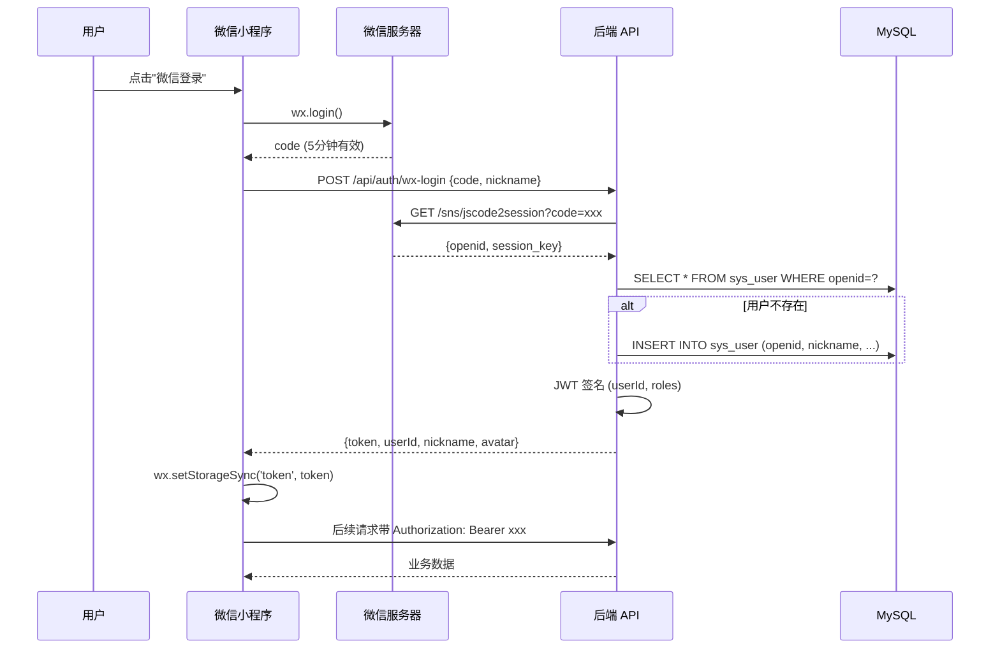

### 10.9 安全考虑

| 风险 | 防护 |
|---|---|
| AppSecret 泄露 | 后端用, 不放前端 + 定期 rotate |
| code 截获 | 5 分钟过期 + HTTPS |
| session_key 泄露 | 不传给前端, 仅后端使用 |
| token 伪造 | JWT 签名 + 短期 + refresh |
| 手机号解密密钥 | 仅后端保存 sessionKey, 不传前端 |
| 接口越权 | 后端校验 userId + 角色 + 租户 |

---

## 第 11 章 性能基准与容量规划

### 11.1 性能基准 (单实例, 8C16G)

| 接口 | QPS | P50 延迟 | P99 延迟 |
|---|---|---|---|
| 登录 | 2000 | 20ms | 80ms |
| 用户列表 | 5000 | 5ms | 30ms |
| 智能体对话 (LLM) | 50 | 2s | 5s |
| 知识库检索 (小库) | 1000 | 30ms | 100ms |
| 文件上传 (10MB) | 200 | 200ms | 500ms |
| 工作流单节点 | 1000 | 50ms | 200ms |
| 分布式锁 | 5000 | 5ms | 20ms |
| 雪花 ID | 10000+ | 1ms | 5ms |

### 11.2 容量规划公式

| 资源 | 计算公式 |
|---|---|
| CPU | 业务 QPS × 50ms / 1000 / (核心数 × 0.7) |
| 内存 | (Heap 1GB + 连接池 + 缓存) × 副本数 |
| 存储 | (数据 × 3 + 索引 × 1.5) × 年增长 |
| 带宽 | 平均响应包 × QPS × 8 / 1024 / 1024 (Mbps) |

### 11.3 性能调优 checklist

- [ ] MyBatis 二级缓存 + Redis L1/L2
- [ ] HikariCP 连接池: max 50, min 10
- [ ] JVM: G1GC, Xms=Xmx, MaxGCPauseMillis=200
- [ ] 慢 SQL: 加索引 / 分页 / 缓存
- [ ] 接口幂等: Redis token 防重
- [ ] 限流: 关键接口 Redis token bucket
- [ ] 异步: 耗时操作走 MQ / 线程池
- [ ] CDN: 静态资源 OSS + CDN

---

## 第 12 章 监控与告警

### 12.1 监控指标

#### 12.1.1 业务指标

| 指标 | 来源 | 告警阈值 |
|---|---|---|
| 全局登录 QPS | auth 服务 | > 500/s |
| 登录失败率 | auth 服务 | > 10% |
| 对话平均 token | agent 服务 | > 4000 |
| 知识库检索 P99 | knowledge 服务 | > 500ms |
| 训练任务积压 | trainer 服务 | > 10 |
| 工作流执行失败率 | workflow 服务 | > 5% |
| Seata 全局事务 | seata TC | timeout > 60s |

#### 12.1.2 系统指标

| 指标 | 来源 | 告警阈值 |
|---|---|---|
| CPU 使用率 | node-exporter | > 80% (5min) |
| 内存使用率 | node-exporter | > 85% |
| 磁盘使用率 | node-exporter | > 90% |
| MySQL 连接数 | mysqld-exporter | > 80% of max |
| MySQL 慢查询 | slow_log | > 100/min |
| Redis 内存 | redis-exporter | > 80% of max |
| Nacos 注册数 | Nacos API | < 10 (服务丢失) |
| Seata TC 队列 | Seata metrics | > 1000 |

### 12.2 监控栈

```
Prometheus ← Actuator (Spring Boot 3.x 内置 /actuator/prometheus)
    ↓
Grafana (可视化)
    ↓
AlertManager (告警)
    ↓
钉钉 / 飞书 / 邮件 / 短信
```

### 12.3 启用 Actuator

```yaml
# application.yml
management:
  endpoints:
    web:
      exposure:
        include: health, info, metrics, prometheus
  endpoint:
    health:
      show-details: always
  metrics:
    tags:
      application: ${spring.application.name}
```

### 12.4 Prometheus 配置

```yaml
# prometheus.yml
scrape_configs:
  - job_name: 'ai-platform'
    metrics_path: '/actuator/prometheus'
    static_configs:
      - targets:
        - 'gateway:9000'
        - 'auth:9001'
        - 'agent:9005'
        - 'knowledge:9006'
        - 'workflow:9011'
```

### 12.5 Grafana 面板

导入官方 Dashboard:
- JVM (Micrometer): id `4701`
- Spring Boot: id `12856`
- Seata: id `10807`
- Nacos: 自定义

---

## 附录 A: 完整 API 端点表

| 模块 | 端点 | 方法 | 描述 |
|---|---|---|---|
| auth | `/api/auth/login` | POST | 账号登录 |
| auth | `/api/auth/wx-login` | POST | 微信登录 |
| auth | `/api/auth/register` | POST | 注册 |
| auth | `/api/auth/logout` | POST | 登出 |
| auth | `/api/auth/refresh` | POST | 刷新 token |
| auth | `/api/auth/health` | GET | 健康检查 |
| user | `/api/user/list` | GET | 用户列表 |
| user | `/api/user/page` | GET | 分页 |
| user | `/api/user/feign/by-username` | GET | Feign 查用户 |
| user | `/api/user/feign/create` | POST | Feign 创建 |
| workflow | `/api/workflow/exec` | POST | 单节点执行 |
| workflow | `/api/workflow/exec/batch` | POST | 批量执行 |
| workflow | `/api/workflow/spec` | POST | 保存模板 |
| workflow | `/api/workflow/run` | POST | 启动运行 |
| distributed | `/api/distributed/lock/demo` | POST | 抢锁 |
| distributed | `/api/distributed/snowflake/next` | GET | 雪花 ID |
| distributed | `/api/distributed/ratelimiter/check` | POST | 限流 |
| ... | ... | ... | (150+ 端点) |

---

## 附录 B: 错误码表

| 错误码 | 含义 |
|---|---|
| 0 | 成功 |
| 400 | 参数错误 |
| 401 | 未登录 / token 失效 |
| 403 | 无权限 |
| 404 | 资源不存在 |
| 500 | 内部错误 |
| 1001 | 参数校验失败 |
| 1002 | 租户信息无效 |
| 1003 | 数据已存在 |
| 1004 | 数据不存在 |
| 2001 | 用户不存在 |
| 2002 | 用户名或密码错误 |
| 2003 | 账号已被禁用 |
| 2004 | Token 已过期 |
| 2005 | Token 无效 |
| 3001 | 模型不存在 |
| 3002 | 模型训练中 |
| 3003 | 模型推理失败 |
| 4001 | 智能体执行失败 |
| 4002 | 工具不存在 |
| 5001 | 知识库索引失败 |
| 9999 | Seata 分布式事务失败 |

---

## 附录 C: 端口分配

| 端口 | 服务 |
|---|---|
| 8080 | 前端 Vite dev server |
| 8848 | Nacos |
| 9000 | Gateway |
| 9001 | auth |
| 9002 | user |
| 9003 | system |
| 9004 | files |
| 9005 | agent |
| 9006 | knowledge |
| 9007 | inference |
| 9008 | model |
| 9009 | trainer |
| 9011 | workflow |
| 9020-22 | seata-demo (3 服务) |
| 8091 | Seata TC (Netty) |
| 7091 | Seata Web Console |
| 3306 | MySQL |
| 6379 | Redis |
| 9898 | Seata metrics |

---

**文档结束.** 共 12 章 + 3 附录, 涵盖架构、模块、流程、操作、原理、微信小程序、性能、监控.
